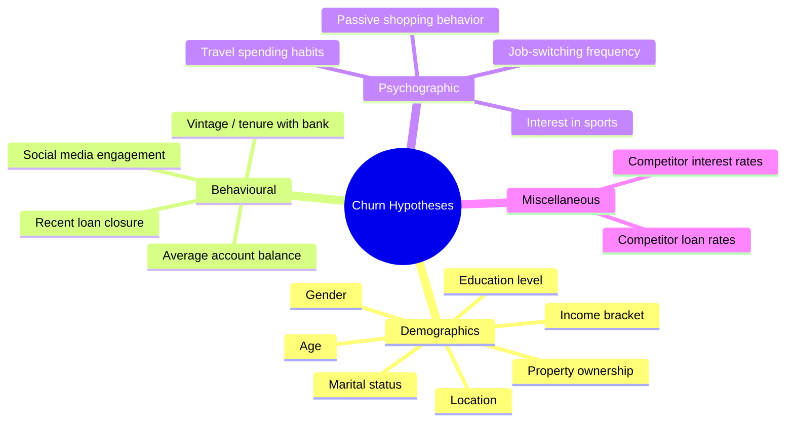
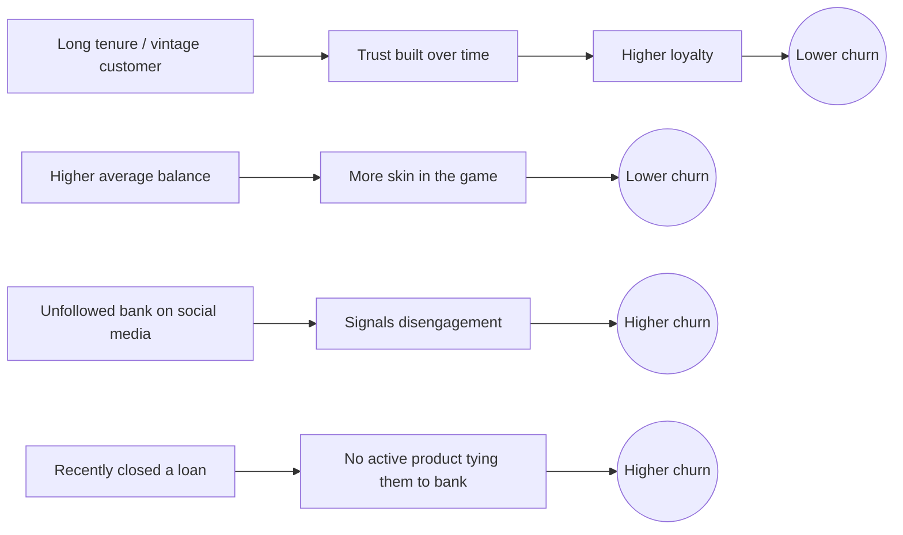
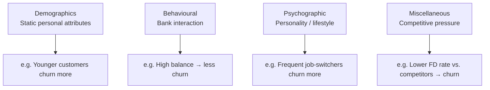

# Hypothesis Generation — Churn Prediction

**Topic:** How to brainstorm hypotheses before touching data
**Context:** Churn prediction problem

---

## Problem Statement

- Goal: identify customer segments most likely to churn
- **Churn definition:** balance drops ≥ 50% next quarter vs. current quarter
- Task: before opening the dataset, list out possible driving factors from domain knowledge/intuition

---

## Why Hypothesize First?

- Prevents tunnel vision — jumping straight into data means only exploring columns that already exist
- Missed factors = missed data sourcing opportunities
- Acts as a checklist to validate the dataset against later
- Forces domain thinking (banking, psychology, competition) — not just stats

---

## Framework: 4 Buckets

Process: **broad categories → drill down → list hypotheses per category**

---

### 1. Demographics
*Static, easily available customer attributes*

- Females vs. males — who churns more?
- Younger customers → higher churn?
- Married → lower churn?
- Education level → correlation?
- Income bracket → correlation?
- Property owners → lower churn? (stability anchor)

---

### 2. Behavioural
*What the customer does with the account*

---

### 3. Psychographic
*Personality / lifestyle*

> Rule: no "wrong" hypothesis at this stage — be exhaustive, don't filter for what sounds plausible.

- Higher travel spend → more churn? (financially adventurous, less loyal)
- Interest in sports → more churn? (sounds arbitrary — list it anyway, let data decide)
- Passive shopping behavior → more churn?
- Frequent job switching → more churn? (general life instability)

---

### 4. Miscellaneous
*External / competitive factors*

- Lower FD interest rate vs. competitors → higher churn?
- Higher education loan interest rate vs. competitors → higher churn?

Note: churn isn't only about the customer — it's relative to market alternatives.

---

## Key Takeaway

- Exercise like this can scale to **~100 hypotheses** for a real problem
- Process > specific list:
  1. Start broad — pick categories
  2. Go deep — max hypotheses per category
  3. No self-censoring — validate later with data, not upfront intuition
  4. Use as a data checklist — gaps = sourcing needs

---

## Quick Reference

---

## Notes to Self

- Similar in spirit to a fishbone/Ishikawa diagram (root-cause analysis) — applied to prediction instead of defect analysis
- Categories = prompts to avoid stopping at the first 3–4 obvious variables
- TODO next time: tag each hypothesis by testability given typical banking data
  - e.g. "sports interest" — not a direct column, would need inferred/external data (transaction categories etc.)
