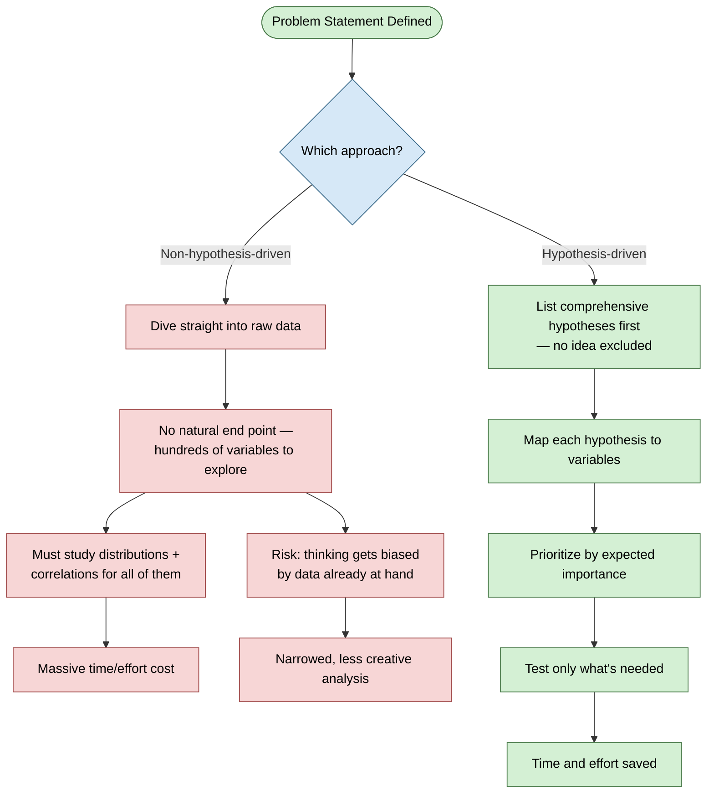
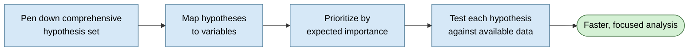
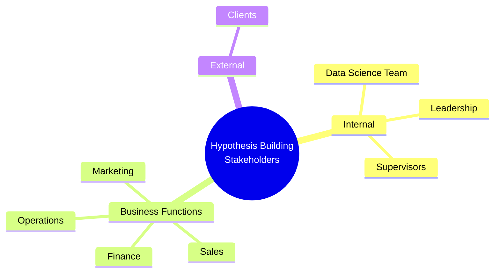
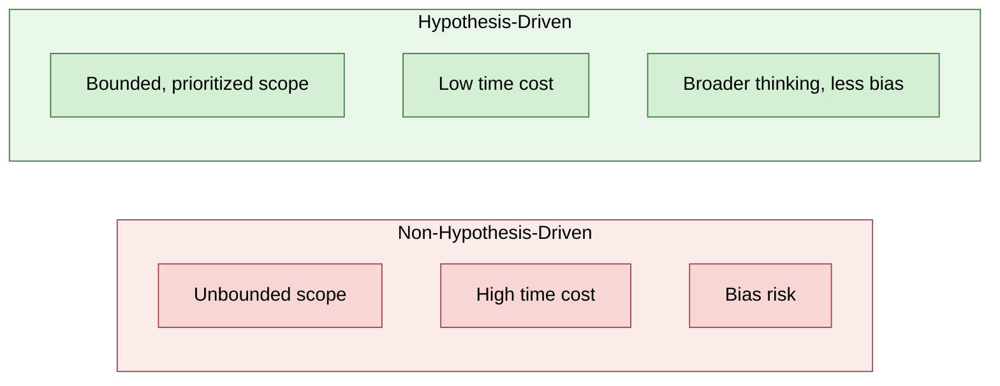

# Hypothesis Generation — Why It Matters in Data Science

**Topic:** The concept and importance of hypothesis generation as a first step in a data science project
**Context:** Precedes building the actual hypothesis list for a business problem (e.g. churn prediction)

---

## Introduction

- **What:** Hypothesis generation is the process of brainstorming and listing every possible view/assertion (hypothesis) about a problem statement — before touching the data. A hypothesis may turn out true or false; the point at this stage is just to state it.
- **Why:** It prevents two failure modes of jumping straight into data: (1) endless, unfocused exploration across hundreds of variables, and (2) getting biased/anchored by whatever data happens to be available, narrowing your thinking instead of broadening it.
- **When:** Right after the problem statement is defined, before any data exploration (EDA) begins. It's the second step in the workflow: problem statement → hypothesis generation → data collection/mapping → testing.
- **How:** List a comprehensive, unfiltered set of hypotheses (no idea excluded for "sounding crazy"), then map each hypothesis to variables, prioritize by expected importance, and test against available data — bringing in relevant stakeholders beyond just the data science team.
- **Where:** Applicable to any data science / analytics project with a defined business problem — not just churn, but risk modeling, marketing analytics, operations problems, etc.

---

## Core Concept: What Is a Hypothesis?

- A **hypothesis** = a possible view or assertion about the problem being worked on
- May or may not be true — truth is determined later, via testing
- **Hypothesis generation** = brainstorming + listing down all possible hypotheses for a given problem statement

---

## Two Approaches Compared

**Core insight:** the non-hypothesis-driven route feels natural ("get familiar with the data first") but doesn't scale — it has no stopping condition and quietly narrows your thinking to what's already in front of you. The hypothesis-driven route front-loads the thinking, so the later data work is targeted.

---

## The Process, End to End

- Working through hypotheses in **order of expected importance** — not randomly — is what compresses the timeline
- Some hypotheses will map to variables that don't exist yet in the dataset → flags a data-collection gap, not a dead end

---

## Who Should Be Involved

- **Not a data-science-only exercise** — this is explicitly called out as a common mistake (skipping stakeholder involvement)
- Relevant groups to pull in:
  - Clients
  - Supervisors / leadership team
  - Marketing
  - Sales
  - Finance
  - Operations
- Reasoning: each function sees the problem from a different angle — an exhaustive hypothesis list needs input beyond what one team can imagine alone

---

## Key Takeaway

- Hypothesis generation is a **pre-data thinking exercise**, not a data exercise
- Non-hypothesis-driven analysis has no natural stopping point and risks anchoring bias
- Hypothesis-driven analysis: brainstorm → map to variables → prioritize → test — saves significant time and effort
- Exhaustiveness requires cross-functional input, not just the data science team working in isolation

---

## Quick Reference

---

## Notes to Self

- This is the theoretical/motivational piece — the follow-up (already have notes on this) is the actual applied hypothesis list for the churn prediction problem, broken into Demographics / Behavioural / Psychographic / Miscellaneous buckets
- Connects to general product/strategy thinking too — "don't boil the ocean, prioritize by expected impact" shows up everywhere, not just in data science
- TODO next time: when I do this for a real problem, actually track which hypotheses mapped to *missing* variables — that list becomes a natural data-collection roadmap, not just a discard pile
