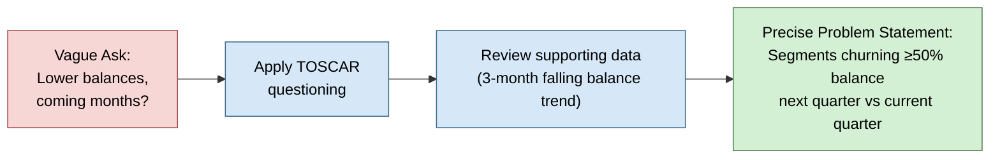

# Problem Definition — From Vague Ask to Precise Problem Statement

**Topic:** Refining a vague business ask into a precise, testable problem statement (TOSCAR framework)
**Context:** First applied step in the machine learning life cycle, using a real bank case study

---

## Introduction

- **What:** The practice of converting a vague business request into a precise, scoped problem statement — before any modeling work begins. Uses the **TOSCAR framework** (Trouble, Owner, Success criteria, Constraints, Actors, Reference) as a structured questioning tool.
- **Why:** A vague ask ("identify customers likely to carry lower balances") can't be modeled directly — terms like "lower balance" and "coming months" are undefined. Without narrowing scope, effort gets spread across a vague question instead of concentrated on a specific, answerable one.
- **When:** This is the very first step in the applied machine learning life cycle — before hypothesis generation, before data collection, before any modeling.
- **How:** Ask structured clarifying questions across six TOSCAR dimensions, then use stakeholder discussion + supporting data (e.g. trend plots) to arrive at a specific, bounded problem statement.
- **Where:** Applicable to any business-driven data science engagement — this case study is a bank's customer balance/churn problem, but the framework generalizes to any stakeholder request that starts out underspecified.

---

## The Business Scenario

- Role: data scientist at a large bank (~225,000 customer portfolios)
- Ask from Director of Customer Management: *"Can you identify which customers are likely to carry lower balances in their savings account in the coming months?"*
- Problem with the ask as stated:
  - "Lower balance" — undefined (lower than what? by how much?)
  - "Coming months" — undefined (how many months, what time horizon?)
- Conclusion: general direction is clear, but not specific enough to act on directly

---

## Core Concept: The TOSCAR Framework

**T**rouble · **O**wner · **S**uccess criteria · **C**onstraints · **A**ctors · **R**eference

```mermaid
flowchart TD
    Ask([Vague Business Ask]) --> T[Trouble]
    Ask --> O[Owner]
    Ask --> S[Success Criteria]
    Ask --> C[Constraints]
    Ask --> A[Actors]
    Ask --> R[Reference]

    T --> T1[Root cause of the problem]
    T --> T2[Expected impact of solving it]
    T --> T3[Why now — time sensitivity]

    O --> O1[Clear primary owner —<br/>Director of Customer Management]
    O --> O2[Others who should be involved]

    S --> S1[What does success look like]
    S --> S2[How will impact be measured]
    S --> S3[Any pre-agreed success metric]

    C --> C1[Trade-offs and challenges]
    C --> C2[Budget constraints]

    A --> A1[Other stakeholders —<br/>e.g. Communications, Marketing]
    A --> A2[Whose workflow might be affected]

    R --> R1[Was this tried before]
    R --> R2[What worked / didn't work]

    Precise([Precise, Scoped<br/>Problem Statement])
    T1 & T2 & T3 & O1 & O2 & S1 & S2 & S3 & C1 & C2 & A1 & A2 & R1 & R2 --> Precise

    classDef start fill:#d6e8f7,stroke:#3a6a8a,color:#000000
    classDef category fill:#d4f0d4,stroke:#4a7a4a,color:#000000
    classDef detail fill:#f7f7d6,stroke:#8a8a4a,color:#000000
    classDef outcome fill:#d4f0d4,stroke:#4a7a4a,color:#000000

    class Ask start
    class T,O,S,C,A,R category
    class T1,T2,T3,O1,O2,S1,S2,S3,C1,C2,A1,A2,R1,R2 detail
    class Precise outcome
```

### Trouble
- Ask for the root cause behind the request — why is the stakeholder coming for help now
- Surfaces expected impact of a solution
- Reveals time sensitivity / whether there's a timeline to work against

### Owner
- Identify the clear primary owner — here, the Director of Customer Management
- Also check for others in the org who might be involved or should be

### Success Criteria
- What does "done" look like at project completion
- Clarify how they will use the delivered results
- Check whether business impact measurement is already defined
- Ask if a success metric has already been agreed upon

### Constraints
- Trade-offs to be aware of
- Known challenges
- Budget assigned (if any)

### Actors
- Beyond the primary owner, identify other stakeholders — e.g. Head of Communications, Head of Marketing (for collateral/comms work)
- Important because the project's actions/delivery can affect their workflow too
- Good practice: consult them early, give them a heads-up if their workflow will be affected

### Reference
- Check if something similar has been attempted before
- What actions were taken, and were they successful or not
- Helps narrow down promising approaches and avoid known pitfalls

---

## From Vague Ask to Precise Problem Statement

- After TOSCAR-style discussions with stakeholders, supporting data was reviewed: a monthly customer balance trend plot
- Observation from the trend:
  - Balances were increasing overall initially (healthy for the business)
  - In the **last 3 months**, balances started **stagnating and then falling**
- This turned a vague ask into a concrete, time-bound signal to investigate

**Final problem statement:**
> *"What customer segments are more likely to churn balances in the next quarter by at least 50% considering the current quarter?"*

- This statement is specific: bounded time window (next quarter vs. current quarter), bounded threshold (≥ 50% drop), and a clear output (customer segments)
- Filtering down to this level of precision concentrates effort on a small, answerable area instead of chasing a broad, ambiguous question

---

## Key Takeaway

- Never start modeling directly from a stakeholder's first, vague ask
- Use structured questioning (TOSCAR: Trouble, Owner, Success criteria, Constraints, Actors, Reference) to extract the real scope
- Combine stakeholder discussion with supporting data (trend plots, historical patterns) to convert vague language into a measurable, bounded problem statement
- A precise problem statement is what makes the next step — hypothesis generation — possible

---

## Quick Reference

