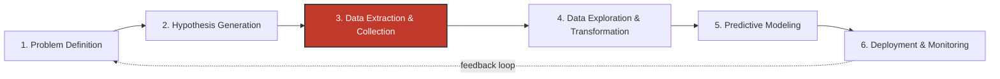
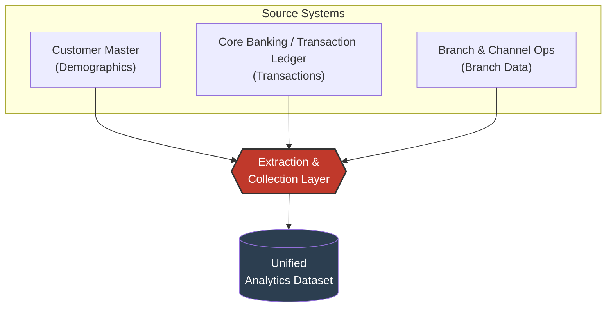
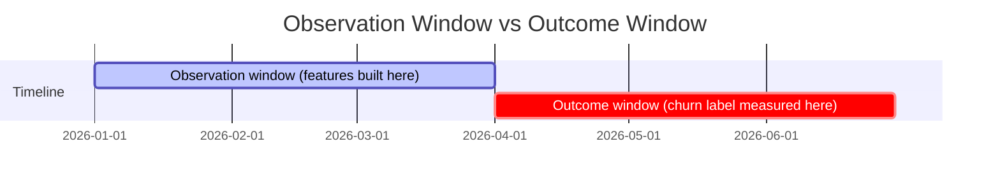
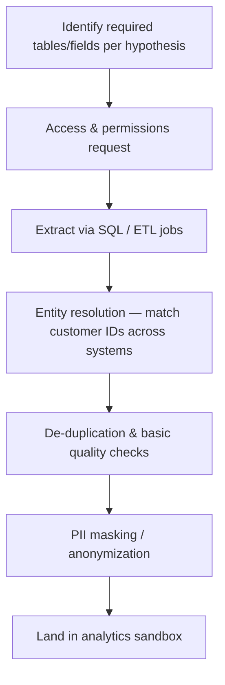
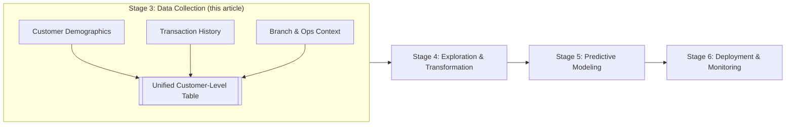

# The Unglamorous Stage That Makes or Breaks Every Churn Model: Data Collection

Every machine learning success story you read online skips to the good part. The 94% AUC. The neural network architecture. The dashboard the CXO loved. Nobody writes the Medium post about the three weeks someone spent reconciling a customer ID field that meant one thing in the CRM and something subtly different in the core banking system.

I want to write that post.

I recently sat through a case study built around a retail banking scenario, and what struck me wasn't the eventual model — it was how much rigor went into *before the model*. So this article is a deep dive into one stage of the data science lifecycle that gets a single bullet point in most course syllabi but eats up 60–70% of real project timelines: **data collection**.

We'll use a churn-prediction case study as our running example, walk through the full project lifecycle so you can see where this stage fits, then go much deeper than the original material into what "collecting data" actually involves at a bank — including the parts nobody puts on a slide.

> A note on the example: the bank, the exact question wording, and the field names below are my own reconstruction for teaching purposes, inspired by a general banking-churn scenario — not a reproduction of any single institution's real data or proprietary materials.

---

## The business question that starts everything

Let's invent a bank — call it **Northbridge Bank** — and give its retention team a real headache:

*"Which customers are likely to draw down their account balances by half or more over the next quarter, compared to where they stand today?"*

Notice what this question is **not**. It's not "which customers will close their account." Balance attrition is a softer, earlier signal — customers rarely close an account the moment they get annoyed; they quietly move money elsewhere first. Catching *balance* churn gives Northbridge a chance to intervene before the relationship ends completely. That distinction matters, and it's the kind of nuance that should be nailed down before anyone opens a database connection.

This is also a good moment to flag something the case study glossed over: **you cannot collect data sensibly until you've defined the problem and formed hypotheses about what might explain it.** Data collection isn't step one because someone drew it that way on a slide — it's step three because steps one and two determine which tables you even bother pulling.

---

## Where data collection sits in the bigger picture

Here's the full lifecycle of a typical applied ML project, at least the version I've found holds up across industries, not just banking:



A few honest observations about this pipeline, from having lived through it more than once:

- **It's drawn as linear. It never runs that way.** You'll bounce from step 4 back to step 3 constantly, because exploration reveals gaps ("wait, we don't have merchant category codes for older transactions") that send you back to pull more data.
- **Step 6 isn't the finish line.** A deployed churn model that isn't monitored quietly rots as customer behavior shifts — this is called *model drift*, and it's arguably as important a topic as anything upstream, just outside the scope of this article.
- The stage in red — data collection — is where we're spending the rest of this piece, because it's the stage where domain knowledge (not math) does the heavy lifting.

---

## Step 2, briefly: why hypotheses come before data

Before Northbridge's analytics team touched a single table, they'd have sat down and asked: *what would plausibly cause someone to drain their balance?* Some candidate hypotheses:

- Customers who've had a support complaint in the last 90 days are more likely to reduce balances.
- Customers whose salary credit disappeared (job change, layoff) are at elevated risk.
- Customers near a branch that recently closed or reduced hours show early signs of attrition.
- Customers who started using a competitor's UPI/payment app frequently might be diversifying their banking relationship.

Every one of these hypotheses points to a *specific data source*. That's the entire point of doing hypothesis generation first — it turns "let's collect all the data" (impossible, and a great way to blow your timeline) into "let's collect the data that could plausibly test these five ideas."

---

## The three pillars: where a bank's data actually lives

In the case study, the data collection stage pulled from three internal systems. I'll describe each one the way a data engineer actually thinks about it — not just "what's in it" but "why it's messy" and "what you'd realistically build from it."



### 1. Customer demographics — the "who"

This typically lives in a customer master or CRM system, and would include things like:

- Age, gender, marital status, occupation
- Tenure with the bank (account open date)
- Income bracket / declared income
- Products held (savings account, credit card, loan, fixed deposit)
- Digital engagement flags (mobile app registered? net banking active?)

The trap here: demographic data is *slow-moving* and often *stale*. Occupation fields in particular are notoriously outdated — someone declared "student" eight years ago and is now a practicing architect, but nobody updated the record. A good data collection process flags fields by their last-updated timestamp, not just their presence, because a five-year-old "income bracket" value is close to useless as a churn predictor.

### 2. Transaction data — the "what they do"

This is usually the richest and largest source, coming straight from the core banking ledger:

- Debit/credit transaction amounts and timestamps
- Transaction channel (ATM, branch, mobile, net banking, UPI)
- Merchant category codes for card spends
- Average monthly balance, minimum balance, balance trend
- Standing instructions, salary credits, EMI debits

This is where **RFM-style thinking** (Recency, Frequency, Monetary) earns its keep, even before formal feature engineering starts:

- *Recency* — days since last transaction of any kind
- *Frequency* — number of transactions in the trailing 30/60/90 days
- *Monetary* — average balance, total inflow vs. outflow

Even at the collection stage, it's worth deciding the **observation window** and the **outcome window** explicitly:



Get this window wrong — say, by letting a feature "peek" into the outcome period — and you've introduced **label leakage**. Your model will look brilliant in testing and fall apart in production. This is one of the most common and most embarrassing mistakes in churn modeling, and it's a data-collection-stage decision, not a modeling-stage one.

### 3. Branch and channel data — the "context"

The least glamorous, most underrated source:

- Branch location, branch type (urban/semi-urban/rural), footfall
- Complaint logs and resolution time
- Relationship manager assignment and manager tenure
- Recent branch changes (closures, staff turnover, service disruptions)

Northbridge's team including this source tells you something important: **churn isn't only a customer-side phenomenon.** A branch losing an experienced relationship manager, or a call center having longer wait times that quarter, can move the needle on attrition just as much as anything the customer did. This is exactly the kind of source a purely "customer-centric" data science team forgets to pull — and it's usually the operations team, not the data team, that has to be looped in to get it.

---

## What "collection" actually involves, technically

The case study presented collection as three boxes feeding one circle. In practice, that circle is doing a lot of work. Here's a more honest breakdown of what that "Extraction & Collection" step contains:



A quick, deliberately simplified illustration of the kind of extraction logic involved — written generically, not copied from any production system, just to show the shape of the problem:

```sql
-- Illustrative example only: pulling a 90-day transaction summary
-- per customer, joined against a masked demographic snapshot.

SELECT
    c.customer_ref_id,
    c.age_band,
    c.tenure_months,
    c.declared_income_band,
    t.txn_count_90d,
    t.avg_monthly_balance_90d,
    t.balance_trend_90d,
    b.branch_type,
    b.open_complaints_90d
FROM customer_master_masked AS c
JOIN txn_summary_90d AS t
    ON c.customer_ref_id = t.customer_ref_id
LEFT JOIN branch_context AS b
    ON c.home_branch_id = b.branch_id
WHERE c.account_status = 'ACTIVE';
```

Two things worth calling out in that snippet:

1. **`customer_master_masked`** — masking or tokenizing personally identifiable information (name, phone, exact address, account number) *before* it ever reaches an analyst's sandbox isn't optional in banking; it's usually a regulatory requirement (and just good practice everywhere else too).
2. **Entity resolution** is doing invisible work in that join. In real systems, the "same" customer might have a different ID format in the CRM versus the core banking system versus the card management system. Reconciling those IDs is often its own multi-day sub-project, and it rarely gets its own line item in a project plan.

---

## Data quality problems you will absolutely hit

Since the goal here is not to gloss over anything, here's the checklist I'd actually hand someone doing this work for the first time:

- **Missing values that aren't random.** If income is missing disproportionately for self-employed customers, that's not "missing at random" — it's informative, and how you handle it (impute vs. flag vs. drop) can bias your model.
- **Silent schema drift.** A field that used to store `Y`/`N` starts storing `1`/`0` after a system migration halfway through your observation window.
- **Definition mismatches across sources.** "Active customer" might mean "logged in once" to the digital team and "did a transaction" to the core banking team. Pick one, document it, and make sure everyone downstream knows which one you picked.
- **Survivorship bias in the extract.** If you only pull customers who are *currently* active, you've already excluded the customers who churned hardest and fastest — exactly the population you most want to learn from.
- **Class imbalance baked in from the start.** Balance-churn at the 50%-drop threshold is going to be a minority class — often under 10% of the base. That's a modeling-stage problem, but it's a *collection*-stage decision whether you oversample, stratify your extract, or pull the full population and handle imbalance later.

---

## Bringing it together

Once the three sources are extracted, resolved, and masked, you land in a single analytics-ready table — one row per customer, one column per feature candidate. That table is the actual deliverable of the data collection stage. Not a database. Not a dashboard. A clean, well-documented, leakage-free table that the next stage (exploration and transformation) can start slicing immediately.



From here, the natural next questions — which the original case study flagged as "next steps" but didn't cover — are:

- **Exploration & transformation**: univariate and bivariate analysis against the churn label, correlation checks, outlier treatment, feature scaling.
- **Predictive modeling**: given the class imbalance, techniques like SMOTE, class-weighting, or threshold tuning matter more here than which algorithm you pick. A well-tuned logistic regression with thoughtful features regularly beats a sloppy gradient-boosted model with leaky ones.
- **Deployment**: churn scores are only useful if they reach a relationship manager's dashboard *before* the customer has already left — which means latency and refresh frequency become product decisions, not just engineering ones.

---

## The takeaway

It's tempting to treat data collection as plumbing — necessary, invisible, and beneath the "real" data science. In practice, it's where most of the domain judgment calls live: which sources matter, how to define the outcome window, where leakage sneaks in, what "active" even means. Get this stage wrong and no amount of hyperparameter tuning downstream will save the model. Get it right, and the modeling stage — the part everyone wants to skip ahead to — often turns out to be the easy part.

If you're starting your own churn (or any attrition-style) project, I'd genuinely suggest spending real calendar time here before opening a modeling notebook. Write down your hypotheses. Trace each one to a specific source system. Define your observation and outcome windows on paper before you write a single query. It's not the exciting part of the job — but it's the part that decides whether the exciting part is even worth doing.

---

*If you found this useful, I write regularly about the less-glamorous, more-consequential parts of applied machine learning — the data engineering, the domain judgment calls, the stuff that doesn't fit in a two-minute demo. Follow along for more.*
