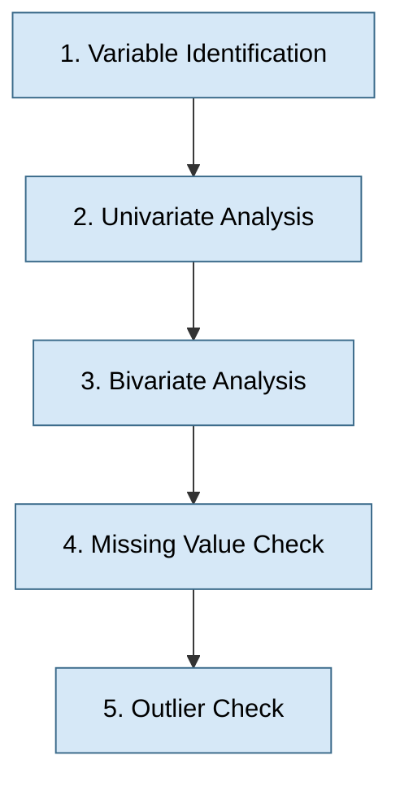
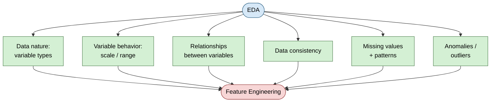

# Exploratory Data Analysis — Why and How Before Modeling

**Topic:** Exploratory Data Analysis (EDA) as a core step in the machine learning pipeline
**Context:** Comes after problem definition and hypothesis generation, before feature engineering and modeling

---

## Introduction

- **What:** EDA is the step where raw data is explored and analyzed to draw out inferences and insights, before any feature engineering or modeling happens.
- **Why:** Without understanding the data first, feature engineering becomes trial-and-error instead of informed design. EDA surfaces variable types, scale/range behavior, relationships between variables, data consistency, missing values, and anomalies — all of which directly shape what features and models will actually work.
- **When:** Follows problem definition and hypothesis generation in the ML pipeline; precedes feature engineering and predictive modeling.
- **How:** A five-step process — variable identification, univariate analysis, bivariate analysis, missing value check, outlier check — leaning on statistical concepts at every stage.
- **Where:** Applies to any machine learning project, regardless of domain — it's a foundational, domain-agnostic step.

---

## Why EDA Matters

- Reveals the **nature of the data**: which variables are numeric, categorical, or a mix
- Reveals **variable behavior**: scale and range (e.g. a variable ranging 0–10 vs. one ranging 0–1,000,000 behaves very differently in a model)
- Reveals **relationships between variables** — how they depend on or move with each other
- Checks **data consistency** — e.g. confirming all expected data is present for a given timeframe
- Checks **missing values** — not just counting them, but looking for an underlying pattern in *why* they're missing
- Checks **anomalies/outliers** — e.g. a person recorded as 200 years old is an obvious data error, not a real observation; each anomaly needs a reason identified and a treatment decision
- Lays the foundation for **feature engineering** — good features come from understanding the data, not guesswork
- Overall: EDA can make or break a machine learning project, since everything downstream (features, model choice, performance) depends on it

---

## Core Concept: The Five Steps of EDA

### 1. Variable Identification
- Discover what type each variable is — numeric, categorical, or a mix
- First step because it determines which statistical tools apply later

### 2. Univariate Analysis
- Discover individual characteristics of each variable, one at a time
- Uses statistics appropriate to the variable type — numerical vs. categorical

### 3. Bivariate Analysis
- Defines the relationship *between* two variables
- Builds on univariate results — now looking at interaction/dependency instead of variables in isolation

### 4. Missing Value Check
- Identify where data is missing
- Determine the **reason**, the **pattern**, and the **extent** of the gaps — missingness is rarely random and understanding why matters for how it's handled later

### 5. Outlier Check
- Identify anomalous values (e.g. an age of 200)
- Some predictive models are sensitive to outliers and require treatment before modeling
- Requires judgment: is it a data error, or a legitimate extreme value?

**Underlying thread:** statistical concepts are needed at *every* one of these five steps — EDA is fundamentally a statistics-driven process.

---

## Key Takeaway

- EDA isn't a formality — it directly determines whether feature engineering is informed or guesswork
- Five-step structure: identify variables → analyze individually → analyze relationships → check missingness → check outliers
- Every step leans on statistics — this is the natural next topic to go deeper on
- Good EDA = foundation for good features = foundation for a good model

---

## Quick Reference

