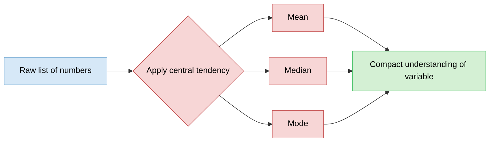
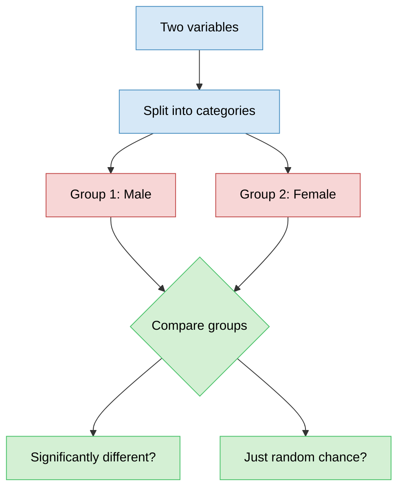
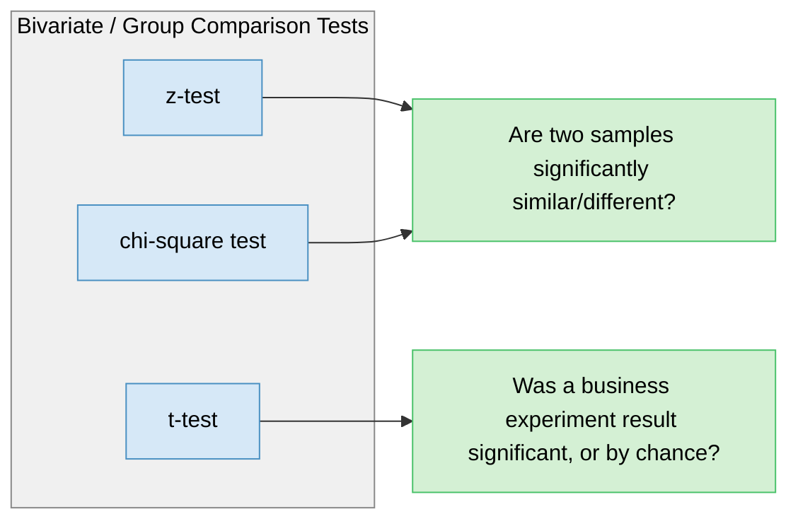
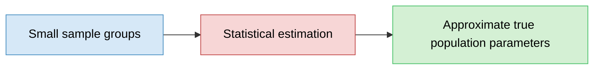
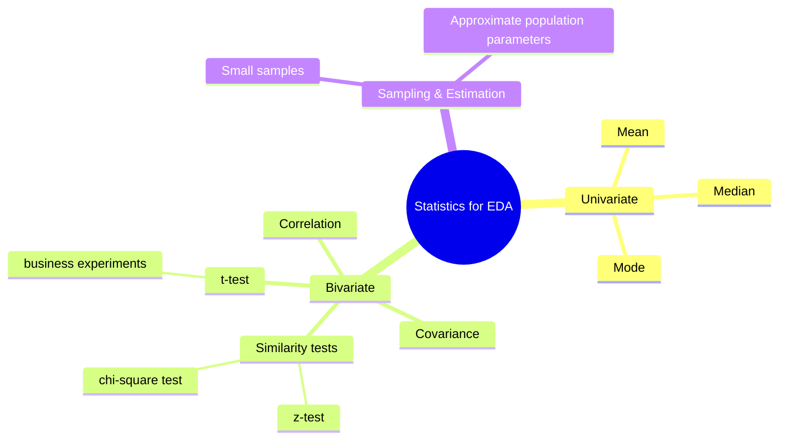
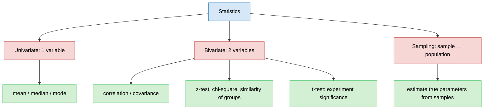

# Statistics for EDA
> Why stats matters for Exploratory Data Analysis — builds on the significance/importance of EDA.

## Overview (What / Why / How)
- **What**: statistics = science of analysis & interpretation of data. Toolkit of concepts to describe variable behavior.
- **Why**: raw data (long lists of numbers) is meaningless at a glance → stats compresses it into interpretable signals (center, spread, relationships).
- **How**: applied differently depending on how many variables you're looking at — univariate (1 var), bivariate (2 vars), and beyond (sampling → population).

## Problem Statement
- EDA needs a way to describe data, not just stare at it.
- Staring at a raw list of numbers → no insight.
- Need answers to:
  - Where is the data centered?
  - What's the range/spread?
  - What's the average?
- Stats gives the tools to answer these without manually scanning every value.

---

## 1. Univariate Analysis
- Definition: understanding **one variable** and its distribution.
- Core tool: **central tendency** measures.
  - Mean
  - Median
  - Mode
- Example: raw list of numbers → unreadable as-is → central tendency + range give quick understanding of "what this variable holds."

---

## 2. Bivariate Analysis
- Definition: relationship between **two variables**.
- Core question: do the variables depend on each other?

### Key concepts
- **Correlation / Covariance** → define how two variables move together (numeric-numeric).
- **Similarity tests** (z-test, chi-square test) → quantify whether two samples/groups are significantly similar or different.
- **t-test** → used in business experiments to check if results are statistically significant (not just random chance).

### Intuition example
- Two variables given, e.g. a numeric variable split by **gender** (male / female).
- Split data into subgroups (categories) → compare subgroups.
- Question asked: are these subgroups significantly different, or just random variation?
- Reframe: does gender have an effect on this variable?

### Statistical tests — purpose map

---

## 3. Sampling → Population (Estimation)
- Statistics lets you approximate **true parameters of the entire dataset (population)** using **small samples**.
- Layman analogy: imagining/drawing the full big picture from small sample pieces.
- Deeper, more intuitive treatment still to come — not detailed here yet.

---

## Overall Structure / Taxonomy

---

## Key Takeaway
- Statistics = the interpretation layer on top of raw data during EDA.
- Univariate → describe **one** variable (center, spread) via mean/median/mode.
- Bivariate → describe **relationship between two** variables via correlation/covariance + significance tests (z, chi-square, t-test).
- Sampling/estimation → generalize from small samples to the full population.
- This is a conceptual overview; each term (correlation, z-test, chi-square, t-test, sampling) warrants a dedicated deep-dive on its own.

## Quick Reference

- Not yet covered in detail (flagged for later): correlation/covariance mechanics, z-test, chi-square test, t-test, sampling theory.
