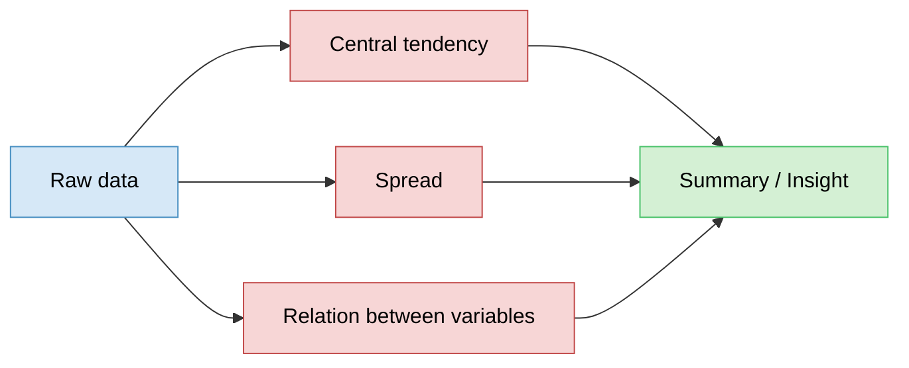
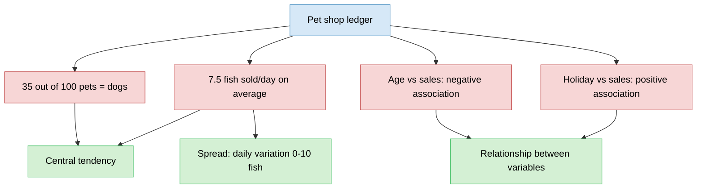
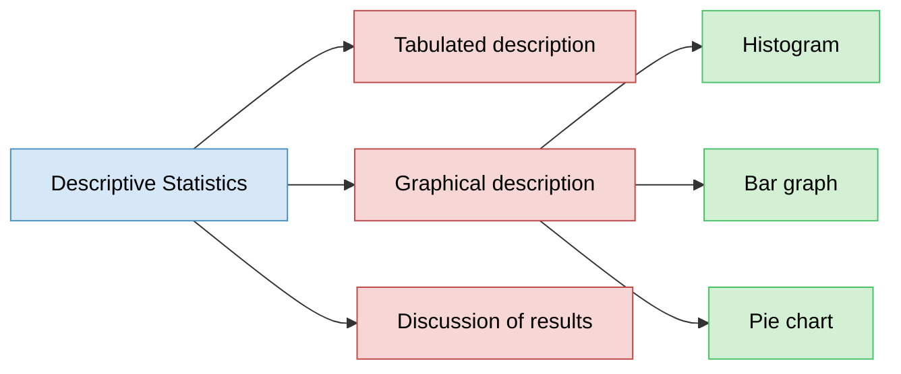
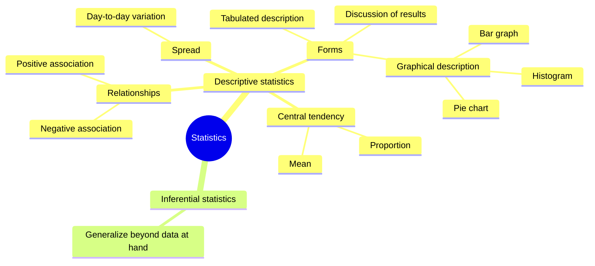
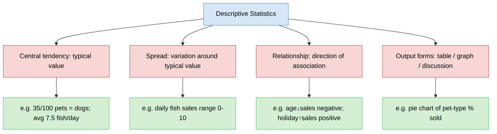

# Descriptive Statistics
> One of the two main branches of statistics — summarizing data as it is, not generalizing beyond it.

## Overview (What / Why / How)
- **What**: descriptive statistics = summarizing a dataset using central tendency, spread, and relationships between variables.
- **Why**: raw transaction-level data (e.g. every single sale) isn't useful to reason about directly — need compact summaries to extract business insight.
- **How**: three complementary forms — tabulated description, graphical description, and discussion of results.

## Problem Statement
- Statistics splits into two main branches:
  - **Descriptive statistics** — summarize the data at hand.
  - **Inferential statistics** — generalize beyond the data at hand (separate topic).
- This note covers descriptive statistics only.

---

## Core Idea: Summarizing Data

---

## Worked Example: Pet Shop Sales
- Shopkeeper keeps a ledger of past business → can answer simple business questions using descriptive stats without doing anything predictive.

### Central tendency
- "Out of every 100 pets sold, 35 are dogs" → proportion as a central/typical value.
- "Sold 7.5 fish on average every day" → mean as central value.
  - Doesn't mean exactly 7.5 fish sold daily — some days 10, some days 0.
  - Average smooths daily fluctuation into one representative number.

### Spread
- Day-to-day variation in fish sold (0 some days, 10 other days) = **spread** around the central value (7.5).
- Spread tells you how much individual days deviate from the average — average alone hides this.

### Relationship between variables
- **Negative association**: age of customer ↔ pet sales (as age increases, sales tend to decrease, customer-wise).
- **Positive association**: whether a day is a holiday ↔ sales on that day (holidays → higher sales).
- Sign of association (positive/negative) captured without needing exact correlation values here — just direction of relationship.

---

## Forms of Descriptive Statistics
- **Tabulated description** — data organized into tables/summary stats.
- **Graphical description** — visual plots (histograms, bar graphs, pie charts).
- **Discussion of results** — narrative interpretation of what the numbers/plots mean.

### Graphical description — common chart types
- **Histogram** — distribution of a single numeric variable.
- **Bar graph** — comparison across categories.
- **Pie chart** — proportion/percentage breakdown of categories (e.g. percentage of each pet type sold at the shop).
- These chart types are common in industry dashboards and presentations for quick visual summaries.

---

## Overall Structure / Taxonomy

---

## Key Takeaway
- Descriptive statistics summarizes what's already in the dataset — no generalization beyond it (that's inferential statistics' job).
- Three summarization angles: central tendency (typical value), spread (variation around that value), and relationships (direction of association between variables).
- Three output forms: tables, graphs (histogram/bar/pie), and narrative discussion.
- Average/central value can hide daily variability — always pair central tendency with spread for a complete picture.
- Direction of association (positive/negative) is a simple but useful descriptive insight even before formal correlation is calculated.

## Quick Reference

- Next branch to cover: inferential statistics — generalizing from data at hand to broader conclusions.
