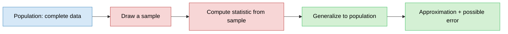
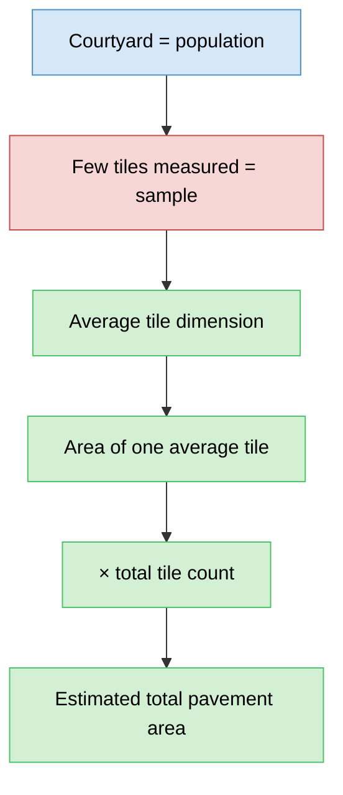
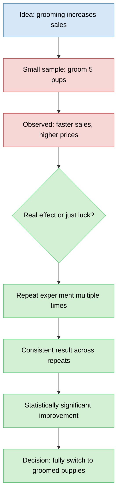
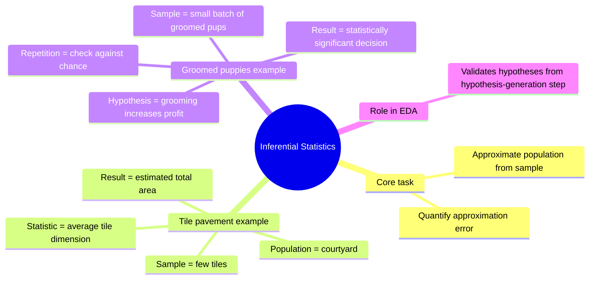
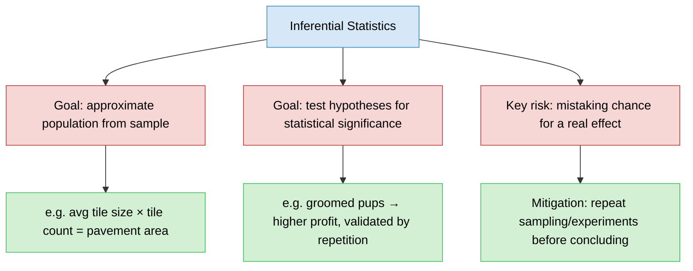

# Inferential Statistics
> The second branch of statistics — using a sample to approximate and validate claims about the whole population.

## Overview (What / Why / How)
- **What**: approximating a population estimate using a sample, and analyzing what approximation errors can occur while doing so.
- **Why**: measuring/observing an entire population directly is often impractical (too large, too slow, too expensive) — a well-chosen sample gives a usable estimate instead.
- **How**: take a small sample → compute a representative statistic from it → generalize/extrapolate that statistic to the full population → validate the generalization by repeating and checking consistency.

## Problem Statement
- Directly measuring or testing an entire population is often infeasible.
- Need a principled way to:
  - Estimate population-level quantities from limited samples.
  - Judge whether an observed effect (in a sample) is real or just chance.
- This is distinct from descriptive statistics, which only summarizes the data already at hand — inferential statistics reasons beyond it.

---

## Core Idea: Population vs Sample

---

## Worked Example 1: Tile Pavement Area
- Task: find total area of tile pavement in a courtyard, using only a coin as a measuring tool.
- Approach (not measuring every tile individually):
  1. Measure dimensions of one tile using the coin.
  2. Recognize tiles slightly differ in size → repeat the measurement across a few tiles.
  3. Calculate the **average** tile dimension from those repeated measurements.
  4. Compute area of a single (average) tile from the average dimension.
  5. Count total number of tiles in the courtyard.
  6. Total area ≈ (area of one average tile) × (total tile count).

### Mapping to inferential statistics concepts
- Courtyard = **population** (complete data).
- Few randomly measured tiles = **sample** from the population.
- Average tile dimension (from sample) = statistic used to approximate the population.
- Total estimated area = population-level approximation built from a small sample.

---

## Worked Example 2: Groomed Puppies Experiment
- Business idea: trimming/grooming pups' hair might make them more presentable → sell faster / at higher prices.
- Constraint: grooming every pup is costly, with no guarantee it works.

### Experiment design (small sample first)
- Groom only **5 pups**, reintroduce to store, observe results.
- Observation: groomed pups sold faster and at higher prices than regular pups.
- Risk: this result could just be luck / chance, not a real effect.

### Validating the hypothesis (repetition)
- Repeat the grooming experiment several more times.
- Consistent result across repeats → groomed pups significantly outperform regular pups in sales/profit.
- Conclusion: switch completely to grooming all puppies.

### Why this is inferential statistics
- The 5-pup (and repeated) experiments = **samples**.
- "Groomed pups bring more profit" = a **hypothesis** being tested.
- Repetition addresses the "is this just chance?" question — core concern of inferential statistics.
- Validating hypotheses in a statistically significant way (not just from one lucky trial) is the essence of this branch.
- Other hypotheses of the same shape: e.g. "do weekends bring significantly more sales?" — same inferential logic, different variable.

---

## Overall Structure / Taxonomy

---

## Key Takeaway
- Inferential statistics = reasoning from a **sample** to conclusions about the **whole population**, plus accounting for the error in that approximation.
- Two-step pattern in both examples:
  1. Estimate something from a small sample (average tile size / grooomed-pup sales lift).
  2. Repeat / validate to distinguish a real effect from random chance.
- Ties directly into EDA workflow: hypotheses generated during EDA get validated using inferential statistics (checking if effects are statistically significant, not just coincidence).
- Contrasts with descriptive statistics: descriptive summarizes what's already known; inferential extrapolates and tests beyond the observed data.

## Quick Reference

- Descriptive statistics + inferential statistics together form the statistical toolkit used throughout EDA.
- Inferential statistics specifically powers the hypothesis-validation step of EDA — confirming whether patterns found are statistically significant, not just noise.
- Next practical step after these concepts: applying them while looking at real data in a Python environment.
