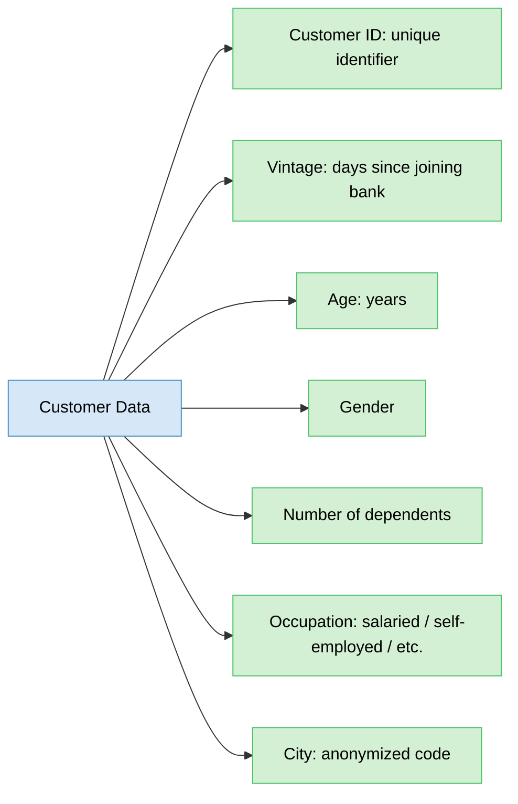
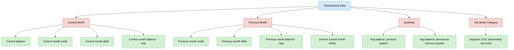
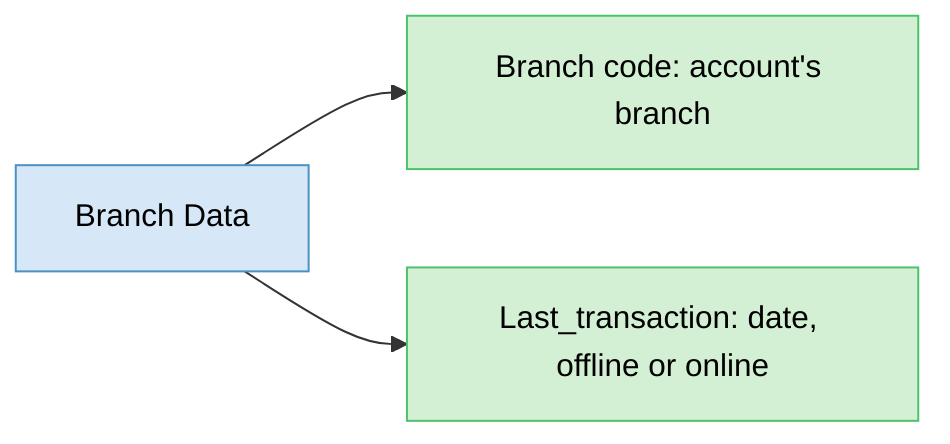
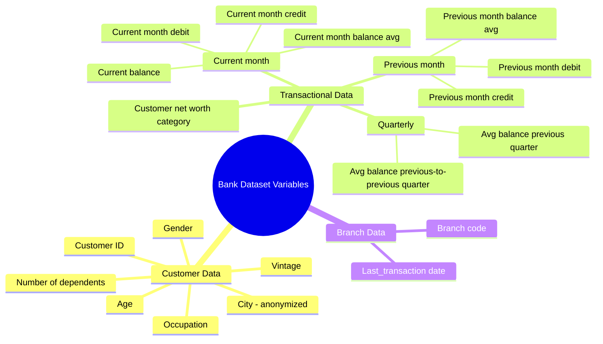
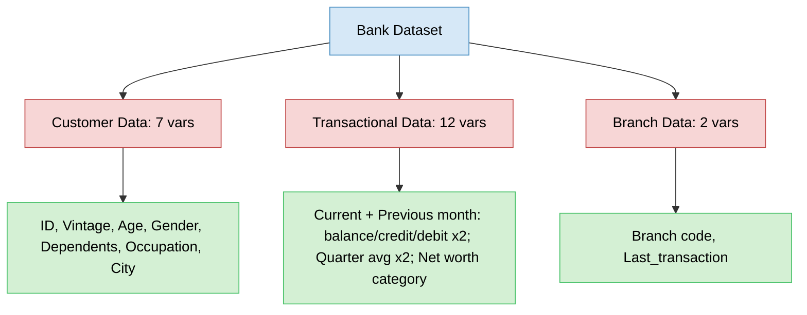

# Bank Dataset: Variable Definitions
> First step of EDA on a banking dataset — understanding what each collected variable actually means before analyzing it.

## Overview (What / Why / How / Where)
- **What**: cataloging every variable across the data sources collected for a banking analysis problem, with its definition.
- **Why**: EDA can't start meaningfully until you know what each column represents — skipping this leads to misinterpreting results later.
- **How**: go source by source, variable by variable, noting what each one captures.
- **Where**: three data sources scavenged from the bank — customer data, transactional data, branch data.

## Problem Statement
- First step in EDA = look at what data has been collected and understand the definition of each variable.
- Three distinct sources feed the analysis:
  - Customer data (who the customer is)
  - Transactional data (what the customer does with their account)
  - Branch data (where/how the account is serviced)

---

## 1. Customer Data
- Describes who the customer is (demographic + profile info).

- **Customer ID** — unique identifier assigned to each customer.
- **Vintage** — number of days since the customer has been associated with the bank.
- **Age** — customer's age, in years.
- **Gender** — customer's gender.
- **Number of dependents** — count of dependents the customer has.
- **Occupation** — category such as salaried, self-employed, etc.
- **City** — anonymized city code (raw city identity converted to a code for privacy).

---

## 2. Transactional Data
- Describes account activity and transaction details per customer.
- Structured around **time windows**: current month, previous month, previous quarter, previous-to-previous quarter.

### Current month variables
- **Current balance** — account balance on the day the data was collected.
- **Current month credit** — total amount credited to the customer in the current month.
- **Current month debit** — total amount withdrawn by the customer in the current month.
- **Current month balance** — average monthly balance for the current month.

### Previous month variables
- Same four variables, but for the previous month:
  - Previous month credit
  - Previous month debit
  - Previous month balance (average monthly balance)
  - (mirrors current month structure — same four transactional aspects, shifted one month back)

### Quarterly variables
- **Average balance, previous quarter** — average balance over the prior 3 months.
- **Average balance, previous-to-previous quarter** — average balance over the 3 months before that (months 4–6 back).
- Note: a quarter = 3 months.

### Net worth category
- **Customer net worth category** — income segment: 1, 2, or 3, denoting net worth group in **descending order** (i.e. 1 = highest group).

---

## 3. Branch Data
- Describes where/how the account is administratively tied and last serviced.
- **Branch code** — code identifying the branch where the customer holds their account.
- **Last_transaction** — date of the customer's last transaction (offline or online).

---

## Overall Structure / Taxonomy

---

## Key Takeaway
- Three data sources, each answering a different question about the customer: **who** (customer data), **what they do with money** (transactional data), and **where/when they last interacted** (branch data).
- Transactional data has a clear time-layered structure: current month → previous month → previous quarter → previous-to-previous quarter — same underlying metrics (credit/debit/balance) tracked across shifting windows.
- Net worth category (1/2/3) is ordinal and descending — treat as ranked category, not a plain nominal label.
- City is anonymized (privacy) — can't be used for geographic lookup directly, only as a categorical code.
- This variable inventory is a prerequisite step before any statistical or visual EDA — establishes vocabulary and scope before analysis begins.

## Quick Reference

- Next practical step: import and read this dataset in Python for hands-on EDA.
