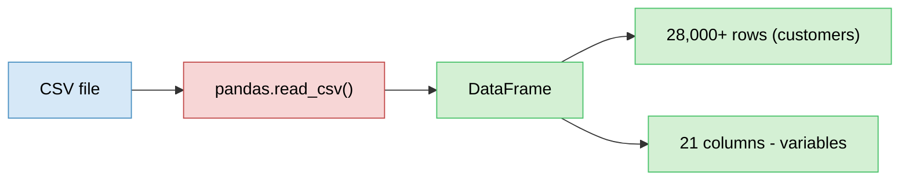
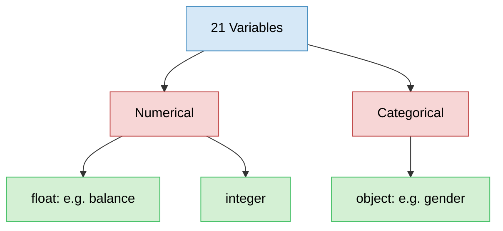
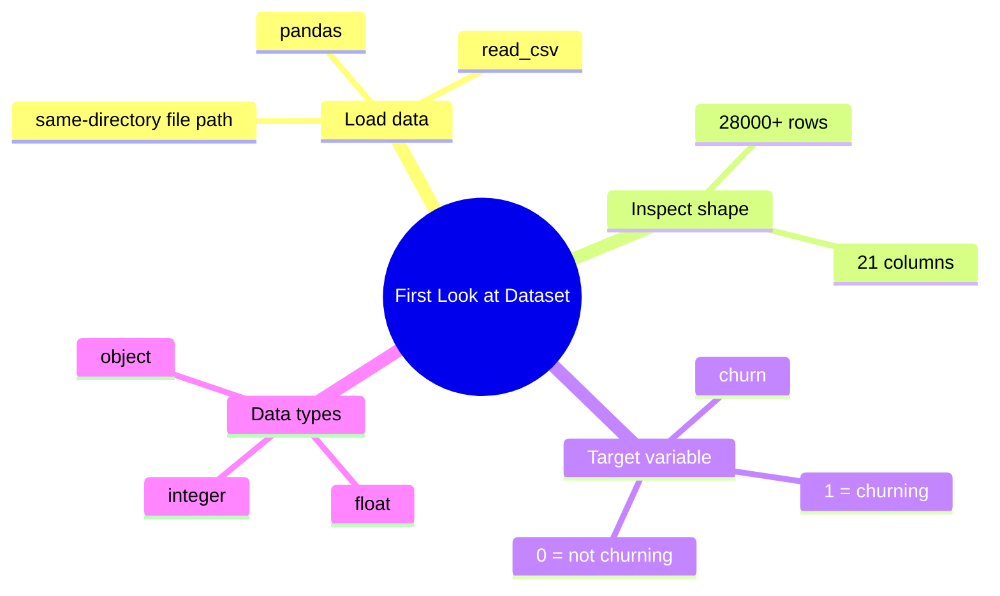
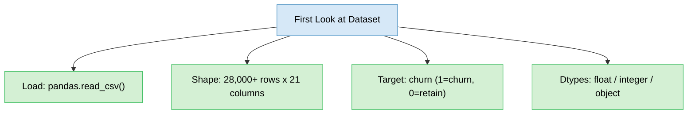

# First Look at the Dataset in Python
> Loading the bank dataset with pandas and doing an initial inspection before deeper EDA.

## Overview (What / Why / How)
- **What**: importing the dataset into Python and inspecting its basic shape — row/column counts, variable list, target variable, data types.
- **Why**: confirms the data loaded correctly and matches the variable definitions already understood, before any real analysis begins.
- **How**: pandas `read_csv` to load, then quick inspection methods to check shape, columns, and dtypes.

## Problem Statement
- Need to move from variable definitions (conceptual) to actual loaded data (practical) in Python.
- Steps: import library → load file → verify row/column count → verify variable list matches expectations → identify target variable → check data types.

---

## Loading the Data

```python
import pandas as pd

df = pd.read_csv("filename.csv")  # file in same directory, no path needed
df.head()  # preview first few rows
```

- Only library needed at this stage: **pandas**.
- `read_csv` reads CSV-format files into a DataFrame.
- File kept in the same directory as the notebook → filename alone is sufficient, no path required.
- `.head()` shows the first few rows — used to sanity-check the variables against the earlier variable definitions.

---

## Dataset Shape
- **28,000+ customers** (rows).
- **21 variables** (columns) total.



---

## Target Variable: Churn
- Column name: **churn**.
- Binary values:
  - **1** → churning customer.
  - **0** → non-churning customer (otherwise).
- This is the variable the whole downstream analysis/modeling effort is oriented around predicting or explaining.

---

## Data Types
- Each variable has one of three data types at this stage:
  - **float** — numerical, continuous (e.g. balance values).
  - **integer** — numerical, whole numbers.
  - **object** — categorical/text (e.g. gender).
- Quick rule of thumb applied:
  - Category-like columns (e.g. gender) → object dtype.
  - Amount/measurement-like columns (e.g. balance) → float dtype, since they're numerical.



- Deeper distinction between these variable types (and what each dtype implies for analysis) is a separate, more detailed topic to study next.

---

## Overall Structure / Taxonomy



---

## Key Takeaway
- pandas + `read_csv` is the minimal toolchain to get a dataset into a usable form in Python.
- Always sanity-check row/column counts and variable names against what was expected from the variable-definition step.
- Identify the target variable early — here, **churn** (binary: 1 = churned, 0 = retained) — it anchors the rest of the analysis.
- Data types (float / integer / object) give an immediate first signal of which variables are numerical vs categorical, before any formal variable-type classification is done.

## Quick Reference



- Next step: study variable types (numerical vs categorical, and their subtypes) in more depth.
