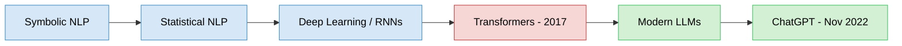
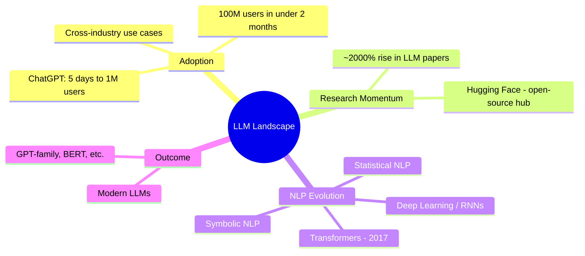

# Getting Started with Large Language Models
*Context: entry point into LLMs — market context (ChatGPT's rise), why LLMs matter now, and the historical arc of NLP leading up to transformers.*

## Introduction

- **What**: A primer connecting the explosive real-world adoption of ChatGPT to the underlying field — Natural Language Processing (NLP) — and its evolution into today's Large Language Models (LLMs).
- **Why**: Understanding *why now* — LLMs didn't appear overnight; they're the product of decades of NLP research converging with a 2017 architectural breakthrough (transformers).
- **When**: Relevant historical arc spans ~1950s (early Symbolic NLP) → 2017 (transformers) → present-day LLM boom (post Nov 2022).
- **How**: Traces the shift across three major NLP paradigms — Symbolic → Statistical → Neural/Deep Learning — culminating in transformer-based LLMs.

## Problem / Topic Statement

- Core goal of NLP since inception: build systems that communicate with humans in natural language.
- Modern trigger point: ChatGPT (launched Nov 30, 2022) demonstrated this goal at mass scale, faster than any consumer app in history.
- Underlying question this course answers: *what technical lineage made ChatGPT-like capability possible?*

## ChatGPT: The Adoption Inflection Point

- Fastest application in history to reach 1M users — **5 days** (vs. ~2.5 months for Instagram).
- Reached **100M users in under 2 months**.
- Adoption spans all age groups, both personal and business use cases.

### Use Cases Driving Adoption
- Trip planning, personal Q&A, health tips, general doubt-clarification.
- Business strategy formulation.
- Data analysis → automated business insights (data analysts).
- Code generation for training/evaluating ML models → removes need to recall syntax, shifts focus to problem-solving (data scientists).
- Marketing/sales → email and campaign drafting.
- Content teams → blog posts, social posts, video scripts at high velocity.
- Common thread: **imagination, not tooling, is the limiting factor.**

## Research Momentum Behind LLMs

- Global research effort now focused on building models that surpass ChatGPT's capability.
- These models are collectively termed **Large Language Models (LLMs)**.
- ArXiv papers with "LLM" in the title: **~2,000% increase** — signals a research inflection, not just a product one.
- Open-source culture accelerating this: researchers publishing models/data openly.
  - **Hugging Face** — leading platform for democratizing and distributing these models.

## Evolution of NLP: Three Paradigms

NLP's progress toward today's LLMs happened in three broad, overlapping eras:

### 1. Symbolic NLP
- Rule-based / hand-crafted linguistic rules and grammars.
- Systems reason over language using explicit logic, not learned patterns from data.
- Foundational era — established that machine-language interaction was a viable goal.

### 2. Statistical NLP
- Shift from hand-written rules to **probabilistic models learned from corpora (data)**.
- Language treated as a statistical phenomenon — likelihoods of word sequences, structures, tags.
- Enabled scaling beyond what hand-crafted rules could cover.

### 3. Deep Learning Era (RNN architectures)
- Neural networks — particularly **Recurrent Neural Networks (RNNs)** — replace explicit statistical feature engineering.
- Models learn language representations directly from data through training, capturing sequential dependencies in text.
- Sets the stage for the architectural leap that follows.

### 4. Transformer Breakthrough (2017)
- **2017 — transformers arrive** — the foundation of current LLM growth.
- Marks the pivot point: every major LLM since (GPT-family, BERT, etc.) builds on the transformer architecture.
- This is the single most consequential architectural shift in the NLP timeline covered here.

## Overall Structure: NLP → LLM Timeline

## Key Takeaway

- ChatGPT's speed of adoption (5 days to 1M users) is a **symptom**, not the cause — the real story is the 2017 transformer architecture, which unified decades of NLP progress (symbolic → statistical → neural) into a scalable, trainable foundation.
- LLM progress today is fueled by two compounding forces: **research volume** (~2,000% rise in LLM papers) and **open-source distribution** (Hugging Face-style platforms).
- LLMs are not a sudden invention — they're the current endpoint of a continuous NLP lineage stretching back to the 1950s goal of natural human-machine communication.

## Quick Reference

