# The Evolution of NLP
### From Handwritten Rules to the Architecture That Made Large Language Models Possible

## Introduction

Natural language processing did not arrive at transformers and large language models in a single leap. It moved through three distinct eras, each one solving the limitations of the one before it, and each one shaped by whatever computational resources and algorithmic ideas happened to be available at the time. Understanding this progression matters because every major design choice inside a modern language model — attention, parallel training, distributed word representations — exists as a direct answer to a specific, historical failure. Nothing was designed in a vacuum.

The story begins in the 1950s with symbolic NLP, an approach built entirely on handwritten grammar rules, and runs through statistical NLP in the 1980s and 90s, where probability replaced hand-coded logic. From there it enters the deep learning era, where recurrent networks first learned to model sequences, then hit a hard mathematical wall, and were rescued by gated architectures like LSTM. The final and most consequential turn arrives with sequence-to-sequence models, the attention mechanism, and ultimately the transformer — the architecture that discarded recurrence altogether and now underlies essentially every large language model in use today.

This chapter traces that path chronologically. Each section builds on the one before it: the limitation introduced at the end of one architecture is precisely the motivation for the next. By the end, the reasoning behind the transformer's design will feel inevitable rather than arbitrary, because it will have been assembled piece by piece out of forty years of accumulated failure and repair.

## Symbolic NLP: The Rule-Based Beginning (1950–1980)

The earliest phase of natural language processing relied on handwritten, grammar-based rules to understand and generate language. This approach is known as symbolic NLP, because meaning was represented explicitly through symbols and logical rules rather than learned from data.

The field's founding public demonstration took place on January 7th, 1954, in New York, when a joint team from Georgetown University and IBM unveiled the first Russian-to-English machine translation system. The system translated more than sixty sentences from Russian into English automatically, relying on a predefined vocabulary and a fixed set of grammatical rules. The demonstration generated enormous public interest and is widely credited with catalyzing serious research investment into machine translation.

The next landmark came from the world of conversational agents. ELIZA, built by a professor at MIT in the 1960s, was the first chatbot to emerge from the symbolic NLP tradition. ELIZA was designed to mimic a psychotherapist, using a set of pattern-matching rules to respond to whatever a user typed. The illusion of understanding was often convincing on the surface, but ELIZA never actually comprehended anything — it matched surface patterns in the user's sentences and reflected them back in a templated form. When conversations drifted outside its expected patterns, its responses broke down, which made it clear to researchers that pattern matching alone was not a viable path to genuine language understanding.

That realization pushed the field toward more elaborate rule systems. In 1968, an MIT professor introduced SHRDLU, a considerably more capable chatbot than ELIZA. SHRDLU worked within a constrained "blocks world" and followed a defined set of rules alongside a fixed vocabulary to interpret and respond to user input. It represented a genuine improvement — its responses felt more like real understanding than anything ELIZA produced — and it is generally regarded as the first system to hold a meaningful, extended conversation between a machine and a human. But SHRDLU's competence was tightly bound to its vocabulary and topic domain. Ask it something outside that boundary and it had no mechanism for producing an answer at all.

This was the central weakness of the entire symbolic era: rule-based models were neither accurate across broad language use nor scalable to new domains. Extending a symbolic system to handle a new task — say, turning a blocks-world assistant into something that could act as a teacher — required writing an entirely new set of rules from scratch. There was no way to generalize what had already been built. That structural limitation is what pushed the field toward a fundamentally different strategy: instead of hand-writing the rules that govern language, why not have a system learn the rules statistically from data? This shift gave rise to the next era of NLP.

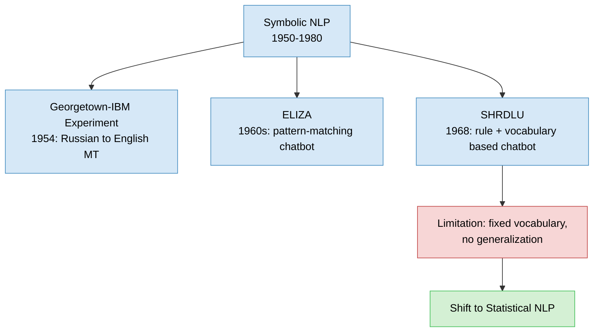

## Statistical NLP: Letting Probability Do the Work (1980–2000s)

By the late 1980s, two things changed simultaneously: computational power increased steadily, and machine learning algorithms began to mature. Together these shifts produced a revolution in NLP known as statistical NLP. Early machine learning methods like decision trees could, in some cases, produce results that resembled the old handwritten rule systems, but the crucial difference was that these newer models made *soft, probabilistic* decisions rather than rigid, deterministic ones.

The most influential idea to emerge from this era was the n-gram language model. N-gram models were first introduced by Claude Shannon in his paper *"Prediction and Entropy of Printed English."* They became extraordinarily popular because of their effectiveness in speech processing, machine translation, and spelling correction, and for a long stretch of the twentieth century they were the simplest and most competitive language modeling technique available.

An n-gram model predicts the next word in a sentence based on a probability derived from statistics gathered over training data. Consider the sentence "the boy is going to." The next word could plausibly be *school*, *home*, *play*, or many other options. An n-gram model assigns each candidate a probability score — for instance, 0.1 for *play*, 0.6 for *home*, and 0.8 for *school* — and the model outputs whichever word carries the highest probability. In this case, *school* wins.

These probabilities are computed directly from frequency counts in the training corpus. Given the input phrase "the boy is going to," the model counts how many times each candidate word (*school*, *play*, *dance*, *home*) follows that exact phrase in the training data, then divides by the total number of times the phrase itself appears. The word with the highest resulting frequency becomes the model's prediction.

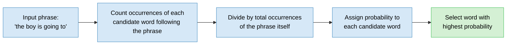

Despite their popularity, n-gram models carried two serious limitations. First, they could not handle new combinations of words that never appeared in the training data. If a novel sentence like "the boy is watching" had never occurred in the corpus, the model had no probability values to draw on and simply could not make a prediction. Second, n-gram models are deterministic: given the same input, they always produce the same output, drawn strictly from patterns already present in the training corpus. They have no capacity to generate genuinely new sentence structures. These two weaknesses — brittleness on unseen word combinations and an inability to generate anything beyond a rearrangement of what was already seen — are what eventually pushed researchers toward neural network-based approaches.

## Deep Learning Enters NLP: Recurrent Neural Networks

Between 2000 and 2017, NLP experienced another wave of transformation, driven again by growing computational power but this time paired with genuine breakthroughs in deep learning architecture. Ordinary neural networks — specifically multi-layer perceptrons — had been tried on text data and had underperformed relative to their results on tabular data. The reason was structural: these networks had no mechanism for capturing the sequential order of words in a sentence. A sentence is not a bag of independent features; the order in which words appear carries meaning, and standard feedforward networks simply could not represent that.

The architecture that solved this was the recurrent neural network, or RNN. An RNN processes text one word at a time, in the order the words appear, carrying forward information from each step into the next. Here is how that sequential processing works, using the sentence "What time is it?" as an example:

At the first step, the network receives the word *"What"* and, having no other context yet, produces an initial output based solely on that word. This first hidden state is then passed forward to the next step. At the second step, the network receives both the carried-forward information from step one and the new word *"time,"* allowing it to make a prediction informed by both words. This process continues, word by word, with each new hidden state absorbing everything the network has learned about the sequence so far. By the time the network reaches the final word, its hidden state carries the accumulated sequence information for the entire sentence.

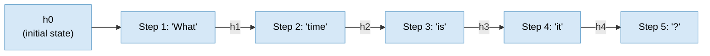

Structurally, an RNN is built from three layers: an input layer, a hidden layer, and an output layer. In the standard notation, `x` represents the inputs, `y` represents the outputs, and `h` represents the hidden states, with superscripts marking the position of each word in the sequence — technically referred to as the time step. At time step 1, the first input word `x1` combines with the initial hidden state `h0` (which starts out as essentially random values) to compute the first hidden state, `h1`. That hidden state is passed both to the output layer, to predict the first output word `y1`, and forward to the next time step.

At time step 2, the second input word `x2` combines with the previous hidden state `h1` to compute `h2`. Because `h1` already encodes information about `x1`, the new hidden state `h2` now carries sequence information about both the first and second words. This pattern continues: at time step 3, `h3` is computed from `x3` and `h2`, and since `h2` already holds information about the first two words, `h3` accumulates the sequence information of all three. By the final time step, the last hidden state contains the accumulated sequence information for the entire input.

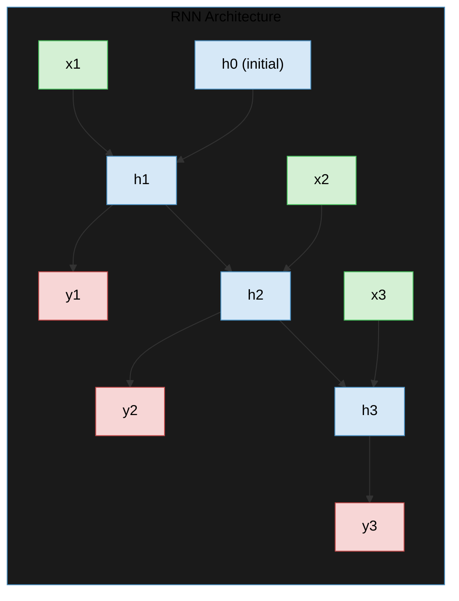

This mechanism made RNNs genuinely effective at NLP tasks, and their ability to capture sequence information was the primary reason for their early success. But that success had a ceiling. RNNs performed well on short sentences, but their performance degraded sharply as sentence length increased. The underlying cause was a well-known problem in neural networks trained by backpropagation: vanishing and exploding gradients.

### The Vanishing and Exploding Gradient Problem

In 1991, the German computer scientist Sepp Hochreiter observed that RNNs function well only on short sentences, and traced the cause to how gradients behave during backpropagation.

Neural network weights are updated using gradients computed during backpropagation. As the number of time steps in an RNN grows — which happens naturally with longer sentences — the gradient calculated at later time steps must be propagated backward through every earlier layer. Because this propagation is multiplicative, small gradient values shrink further and further the farther back they travel, a phenomenon called the *vanishing gradient problem*. When this happens, the weights in the earliest layers of the network barely get updated at all, because the gradient reaching them is effectively zero.

The inverse failure mode is the *exploding gradient problem*. If the gradient values at later time steps are large rather than small, the same multiplicative effect causes them to grow larger and larger as they propagate backward. This results in wildly oversized weight updates in the network's earliest layers during training, which destabilizes learning and degrades performance just as badly as vanishing gradients do — just in the opposite direction.

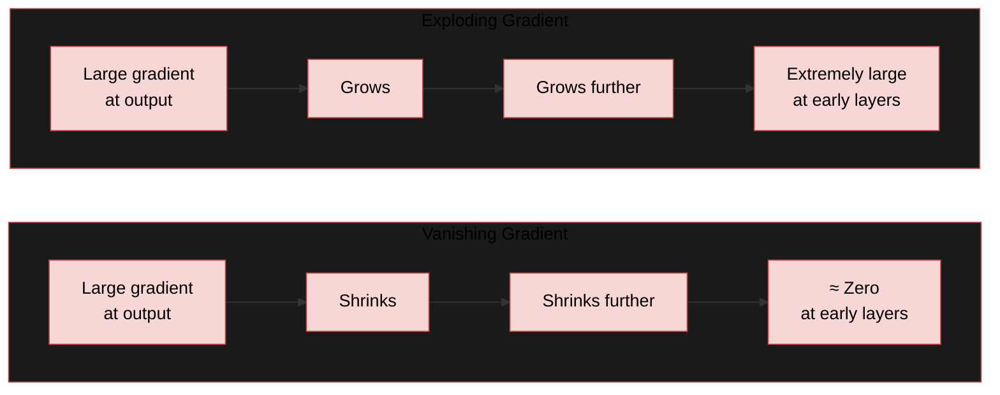

Both failure modes stem from the same root cause: repeated multiplication of gradient values across many time steps. Solving this problem — without abandoning the sequential structure that made RNNs useful in the first place — required a new kind of architecture.

## LSTM: The Gating Solution

Long Short-Term Memory networks, or LSTMs, were introduced specifically to solve the vanishing and exploding gradient problem, and the paper that introduced them is, by some measures, the most cited paper of the twentieth century.

LSTMs overcome the gradient instability of standard RNNs through a gating mechanism. This mechanism allows gradients to remain stable and flow through the network more easily during backpropagation through time, rather than shrinking or growing uncontrollably. At a high level, an LSTM unit consists of four key components: the cell state, and three gates — the forget gate, the input gate, and the output gate.

A useful way to think about the cell state is as something like a working memory, similar to how a human brain holds onto current thoughts. Just as we can choose to forget certain memories or update others, the gates in an LSTM regulate what information stays in the cell state, what gets discarded, and what gets output at any given step.

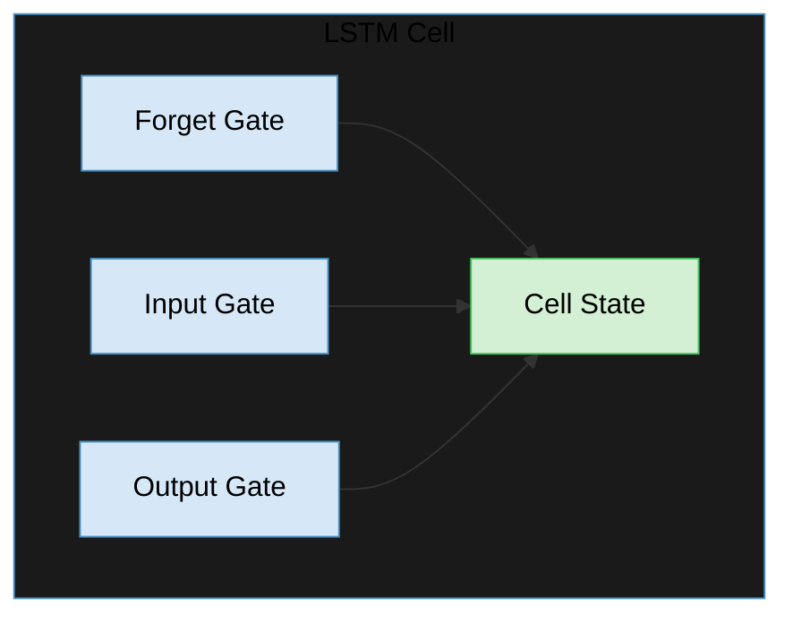

Following the LSTM paper, most subsequent progress in NLP built directly on this gated architecture. Alongside these developments in network design, researchers also revisited the language modeling problem itself, since the existing n-gram approach — despite the field's overall progress — had not improved. This led to a new state-of-the-art approach introduced in 2003: the neural language model.

## Neural Language Models

The neural language model was introduced in the paper *"A Neural Probabilistic Language Model"* as a direct answer to the limitations of n-gram models discussed earlier — specifically their inability to generalize to unseen word combinations.

The objective of a neural language model is straightforward: predict the next word in a sentence given the words that came before it. Its architecture mirrors this goal directly. Given the input word *"The"* at the first time step, the model predicts the next word, *"quick."* At the second time step, given the word *"quick,"* it predicts *"brown."* This continues word by word, with the model at any time step *t* predicting the word at *t + 1* by taking into account every word that preceded it.

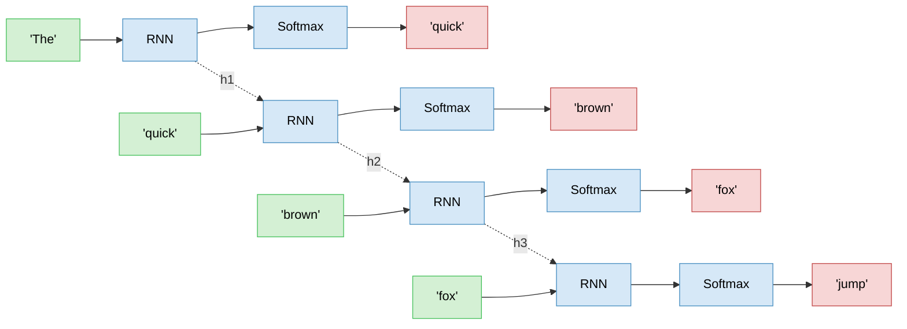

This approach improved performance across various NLP tasks, including machine translation and speech recognition. But it, along with the RNN and LSTM architectures more broadly, still struggled with a different class of problem: sequence-to-sequence tasks, where the input and output are both variable-length sequences that don't necessarily correspond word-for-word — machine translation being the clearest example.

## Sequence-to-Sequence Learning and the Encoder-Decoder Architecture

In 2014, a new architecture was introduced specifically to handle sequence-to-sequence tasks: the encoder-decoder architecture. This design solves problems where the input and output sentences may differ in length — machine translation being the canonical case, since a sentence in one language rarely has exactly as many words as its translation in another.

At a high level, a sequence-to-sequence model takes an input sentence, understands it, and generates a corresponding output sentence. The model is built from two components: an encoder and a decoder. The encoder's job is to capture the information contained in the input sentence and compress it into a representation that the decoder can use; the decoder's job is to take that representation and generate the output sentence, one word at a time.

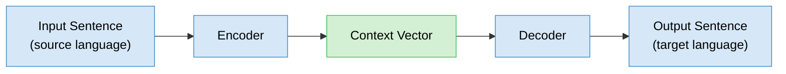

Both the encoder and the decoder are, in this original formulation, built from RNNs. The encoder RNN processes each word of the input sentence one at a time and folds all of that information into a single vector, called the context vector. This context vector is then handed off to the decoder RNN, which uses it to generate the output sentence word by word. The two RNNs are trained jointly, so the whole system learns to translate — or otherwise transform — one sequence into another.

Concretely, for the sentence "I am fine" being translated into Hindi: the encoder processes "I," "am," and "fine" sequentially, producing hidden states `h1`, `h2`, and `h3`, and compresses the final hidden state into a context vector `c`. That context vector seeds the decoder, which then generates the output sequence — starting from a `<start>` token and predicting one word at a time until it produces an `<end>` token.

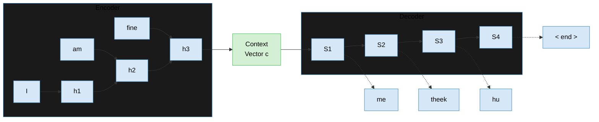

The limitation of this basic encoder-decoder design is that it struggles with longer sentences — generally beyond around twenty words. Performance, measured using BLEU score (a standard machine translation quality metric), drops off drastically as input length increases:

```mermaid
flowchart LR
    A["Short sentences<br/>(~10-20 words)"] -->|High BLEU score| B["Peak translation quality"]
    B -->|Sentence length increases| C["Medium sentences<br/>(~30-40 words)"]
    C -->|BLEU score drops sharply| D["Long sentences<br/>(50+ words)"]
    D -->|BLEU score near zero| E["Translation quality<br/>severely degraded"]

    classDef default fill:#d6e8f7,stroke:#4a90c2,color:#000000
    classDef good fill:#d4f0d4,stroke:#4ac25f,color:#000000
    classDef bad fill:#f7d6d6,stroke:#c24a4a,color:#000000
    class B good
    class D,E bad
```

The reason is structural: the encoder compresses the entire meaning of the input sentence into a single, fixed-length vector, regardless of how long that sentence is. For short sentences this compression is manageable, but for long sentences it becomes genuinely difficult to squeeze all the necessary information into a fixed-size representation without losing something important. That bottleneck is precisely what the attention mechanism was built to remove.

## The Attention Mechanism

In 2015, the attention mechanism was proposed to solve exactly this limitation of the encoder-decoder architecture. Rather than forcing the decoder to rely on a single compressed context vector for the entire sentence, attention allows the decoder to focus on different parts of the input sentence while generating each individual output word.

Consider translating the English sentence "I am fine" into Hindi. In the resulting Hindi translation, the word corresponding to "I" depends much more heavily on the English word "I" than on any other word in the sentence. Attention makes this dependency explicit: when the decoder is predicting the Hindi word for "I," the attention mechanism assigns more weight — pays more "attention" — to the English word "I" than to "am" or "fine." Likewise, when generating the Hindi word corresponding to "fine," attention shifts its focus onto the word "fine" in the source sentence. This type of attention, where the decoder attends back to the encoder's representations, is known as encoder-decoder attention.

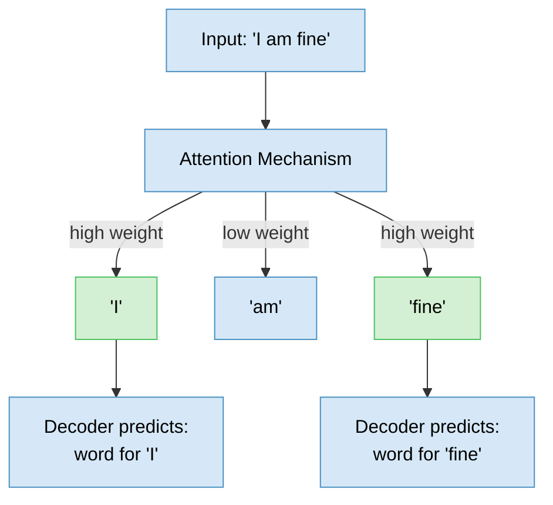

Attention meaningfully improved translation quality on longer sentences compared to the standard encoder-decoder architecture, because the decoder was no longer limited to a single fixed-length summary of the entire input. But by 2017, researchers at Google observed a different problem: encoder-decoder models with attention still took a long time to train as input sentences grew longer, because RNNs process information one word at a time, which rules out parallel processing during training. This training bottleneck — not a quality problem, but a speed and scalability one — is what led directly to the architecture that reshaped the field: the transformer.

## Transformers: Attention Is All You Need

The transformer was introduced in 2017 by researchers at Google, in a paper titled *"Attention Is All You Need."* The paper introduced, for the first time, a neural network architecture that relies entirely on the attention mechanism to solve sequence-to-sequence problems — with no recurrence at all. Applied to machine translation, transformers achieved state-of-the-art results, and the paper's authors concluded that architectures like LSTMs and GRUs were no longer necessary: attention mechanisms alone were sufficient.

The paper was authored by a team from Google Brain, Google Research, and the University of Toronto: Ashish Vaswani, Noam Shazeer, Niki Parmar, Jakob Uszkoreit, Llion Jones, Aidan Gomez, Łukasz Kaiser, and Illia Polosukhin.

At a high level, a transformer reads an input sentence, processes it, and produces an output sentence — the same encoder-decoder framing as before, but built entirely out of feedforward neural networks and attention layers rather than RNNs.

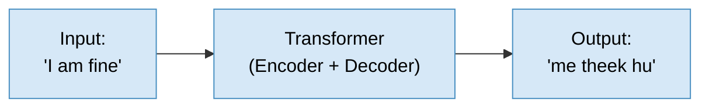

### The Encoder Component

The encoder's job is to build an increasingly refined representation of the input sentence. It is not a single block, but a stack of multiple identical encoder blocks: the first block receives the raw input sentence, processes it, and passes its output to the second block; the second block refines that further and passes it to the third; and so on. The output of the final encoder block holds the richest representation of the input sentence that the model can produce.

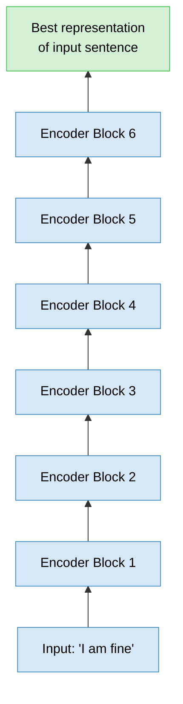

Each individual encoder block contains two layers: a self-attention layer, followed by a feedforward neural network.

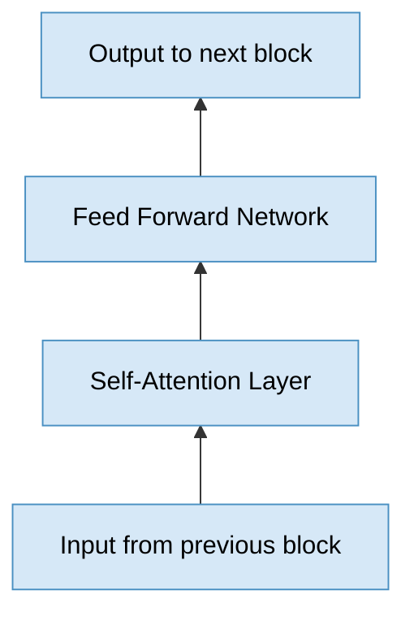

Self-attention is a different mechanism from the encoder-decoder attention discussed earlier, and it is worth distinguishing the two carefully. Consider the sentence: "The animal didn't cross the street because it was so tired." The word "it" refers back to "the animal," but resolving that reference requires context from elsewhere in the *same* sentence — there is no separate input and output sequence here, just one sentence trying to understand its own internal references. This is exactly what self-attention does: when building a representation for the word "it," the self-attention layer assigns higher weight to "the animal" and "didn't," which produces a much better representation of what "it" actually refers to.

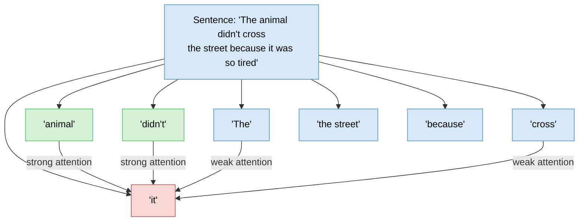

As the name implies, self-attention focuses on other words *within the same sentence* to build a better representation of each individual word — a fundamentally different operation from encoder-decoder attention, which relates two different sequences (source and target) to each other.

### The Decoder Component

The decoder generates the output sentence using the representation produced by the encoder's final block. Like the encoder, it is built from a stack of multiple decoder blocks, and the output of the final encoder block is fed into *every* decoder block to inform its predictions.

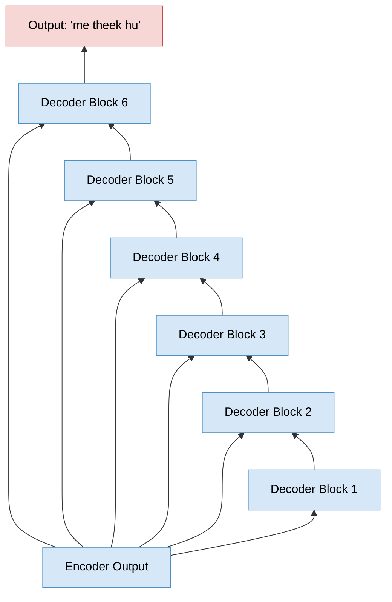

Each decoder block contains three layers, one more than the encoder block: a self-attention layer, an encoder-decoder attention layer, and a feedforward neural network.

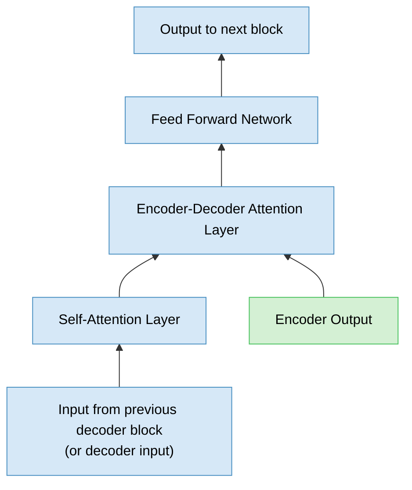

Put together, the full transformer looks like this: a stack of encoder blocks processing the input sentence, feeding into a stack of decoder blocks that generate the output sentence word by word, with every decoder block drawing on both its own self-attention and the encoder's final representation.

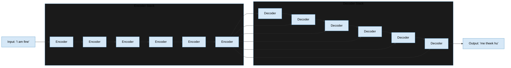

Because the transformer relies entirely on attention and feedforward layers rather than recurrence, it does not need to process a sentence one word at a time the way an RNN does. This is what unlocks parallel training — the exact capability that RNN-based encoder-decoder models with attention were missing — and it is the reason transformers could be trained efficiently even as model and dataset sizes grew dramatically. The transformer set the groundwork for the large language models that followed: architectures like GPT, BERT, LLaMA, and Falcon all draw their core structural ideas directly from this design.

## Key Takeaway

Every major architectural shift in the history of NLP was a direct response to a specific, identifiable failure in what came before it. Symbolic NLP's handwritten rules could not scale or generalize, which motivated a shift to statistical, data-driven modeling. N-gram models could not handle unseen word combinations or generate genuinely new text, which motivated neural network-based language models. Standard neural networks could not represent word order, which motivated recurrent neural networks. RNNs suffered from vanishing and exploding gradients on long sequences, which motivated the gated architecture of LSTM. Basic encoder-decoder models compressed entire sentences into a single fixed-length vector and degraded badly on long inputs, which motivated the attention mechanism. And finally, even attention-augmented RNNs were slow to train because recurrence prevents parallelization, which motivated the transformer — an architecture built entirely on attention and feedforward layers, with no recurrence at all. That final architectural leap is what made the large-scale, parallelizable training behind today's large language models possible.

## Quick Reference

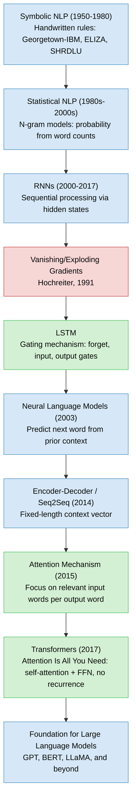
