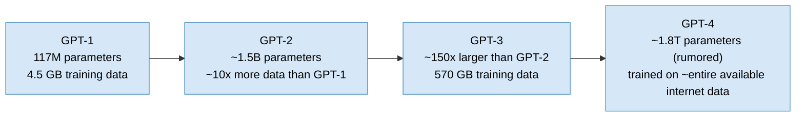
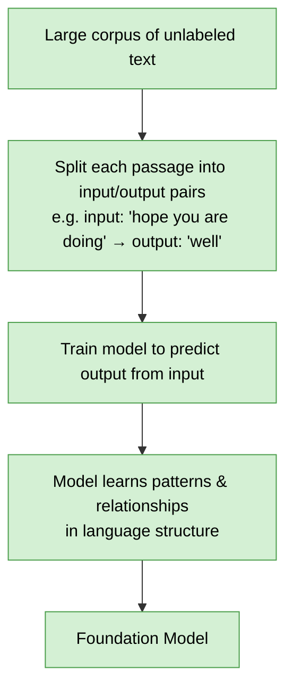
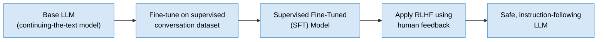
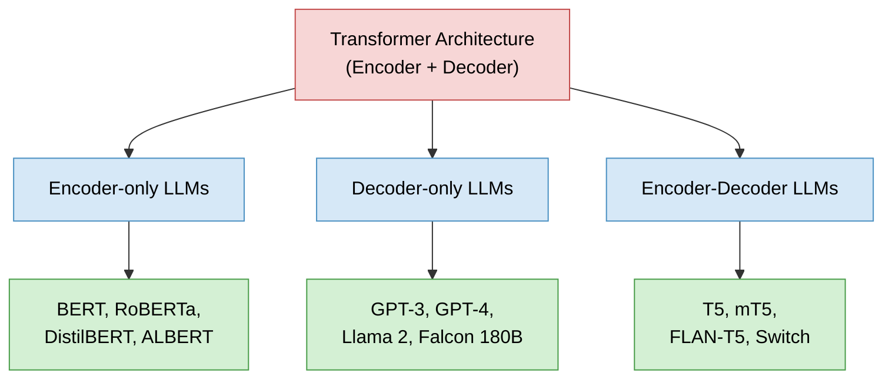
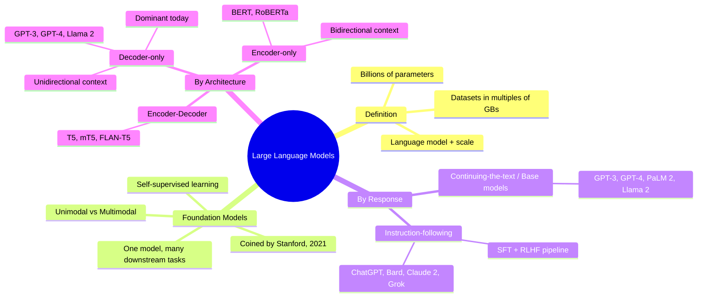

# Large Language Models and the Rise of Foundation Models
### How scale transformed language modeling into general-purpose intelligence

## Introduction

Language models have existed for decades in various forms, but a fundamental shift occurred once researchers began scaling them far beyond anything previously attempted. This chapter explains what large language models (LLMs) actually are, why the word "large" is doing so much work in that name, and how this scaling gave rise to an entirely new category of AI system: the foundation model.

The reason this matters is straightforward. Understanding LLMs requires separating two ideas that are easy to conflate: the mechanics of a language model (assigning probabilities to sequences of words) and the effect of scale (billions of parameters trained on datasets measured in hundreds of gigabytes or more). Once that distinction is clear, the seemingly mysterious behaviors of modern LLMs — completing text fluently, translating languages they were never explicitly taught, or answering questions they were never directly trained to answer — stop looking like magic and start looking like a predictable consequence of scale.

This chapter builds the concept from the ground up: what a language model does, what changes when you make one large, how foundation models generalize this idea beyond just text, and how LLMs differ from one another based on how they respond to input and how they are architected internally. By the end, the distinctions between terms that are frequently used loosely and interchangeably — language model, LLM, foundation model, base model, instruction-following model — will be precise rather than fuzzy.

## What a Language Model Actually Does

At its core, a language model is a system that assigns probabilities to sequences of words based on how likely that sequence is to occur in a given language. It does not "understand" language in a human sense; it has simply learned, from exposure to large amounts of text, which word sequences tend to occur together and which do not.

Consider three candidate sentences:

1. "I am going to school"
2. "Am I going school too?" (the same words as sentence 1, rearranged to break the original grammar)
3. "Me school" (a fragment, and notably in a different language — Hindi, in this example)

A trained language model would assign the highest probability to the first sentence — perhaps around 80% — because it is the most grammatically natural and most frequently observed construction in English. The second sentence, being grammatically broken despite using valid English words, would receive a lower probability, say 19%. The third, being in an entirely different language, would receive the lowest probability of the three, perhaps 1%. This is the entire operating principle of a language model: rank word sequences by how plausible they are, given everything the model has learned about how the language is actually used.

Two classic implementations of this idea are:

- **N-gram language models**, which estimate the probability of a word based on a fixed window of preceding words.
- **Neural language models**, which use neural networks to learn this same kind of prediction, typically framed as predicting the next most likely word given the words that came before it.

Both approaches share the same objective — next-word or sequence prediction — but differ in mechanism. What they have in common is a training approach: expose the model to large amounts of real text, and let it learn statistical regularities about word co-occurrence.

## What Makes a Language Model "Large"

The word "large" in "large language model" is not a vague marketing term — it refers to two very specific, measurable properties: the number of parameters in the model, and the size of the dataset used to train it.

Parameters are the weights and biases of a neural network — the internal values the network adjusts during training to learn the mapping between its inputs and its outputs. Early neural language models, such as ones released around 2003, typically had on the order of millions of parameters. Modern large language models are roughly a thousand times larger, reaching into the billions of parameters.

This increase was not arbitrary. Researchers observed empirically that as both model size and training dataset size increased, language models became progressively more capable — not just in raw accuracy, but in the sophistication of what they seemed to understand. This mirrors a foundational idea in deep learning generally: as a neural network's depth and capacity grow, it becomes better at capturing rich, layered representations of its inputs. Applied to language, more capacity and more data meant the model captured subtler patterns of grammar, meaning, and even reasoning-like structure.

With that grounding, a large language model can be defined precisely: **a language model containing an enormous number of parameters, trained on datasets measured in multiples of gigabytes.** Structurally, it does the same thing a small language model does — learn a probability distribution over word sequences — but the scale of both the model and its training data pushes it into a qualitatively different regime of capability. These models don't merely master surface-level grammar; they begin to exhibit properties associated with more general intelligence: the ability to think through problems, generate novel combinations of ideas, and communicate in ways that resemble human language use.

### The Scaling Story: GPT-1 Through GPT-4

The clearest illustration of this scaling effect comes from OpenAI's GPT series, where each successive generation scaled up both parameter count and training data by large multiples:

GPT-4 is, by these figures, the largest publicly known LLM to date, and this progression demonstrates a consistent pattern: performance continues to improve as both data and parameter count grow. This isn't a coincidental correlation — it's the central empirical finding that justified the entire "bigger is better" trajectory of LLM research.

### Emergent Properties

One of the most striking consequences of this scaling is the appearance of **emergent properties** — capabilities that a model exhibits without having been explicitly trained to have them. These abilities seem to arise spontaneously once a model crosses a certain threshold of scale.

A concrete example: GPT-3 is trained on a single objective — predicting the next word in a sequence. Despite this narrow training objective, if you provide it with the input "how are you in Hindi is," it can complete the sentence in a way that effectively performs translation, even though it was never explicitly trained on a machine translation task. The model has, through sheer exposure to a massive and varied dataset combined with a huge parameter count, absorbed enough about how languages relate to one another that it can perform translation as a side effect of its next-word prediction objective.

This is precisely why a single LLM can be applied to a strikingly broad range of tasks — text classification, question answering, document summarization, text generation, and more — without needing a separately trained model for each one. This generality is the property that leads directly into the next major concept: the foundation model.

## Foundation Models: A Single Model, Many Uses

The term "foundation model" was coined by a Stanford research team in 2021, and it describes something more general than an LLM: an AI model trained on a very large corpus of *unlabeled* data using self-supervised learning, which can then be adapted to a wide range of downstream tasks with minimal task-specific data.

To understand why this framing matters, it helps to first understand the limitation it addresses. Supervised learning, when given a sufficiently large labeled dataset, performs very well — but creating those labels is a manual, human-driven process that doesn't scale to the enormous volumes of unlabeled data available on the internet. Pure unsupervised learning is one way to make use of unlabeled data, but historically it hasn't matched the effectiveness of supervised approaches.

Self-supervised learning offers a middle path: rather than requiring external labels, it constructs training labels directly from the structure of the unlabeled data itself. The clearest example is next-word prediction. Given a stretch of unlabeled text, you don't need a human to label anything — you simply split the text into an input portion and an output portion. For instance, the sentence "hope you are doing well" can be split so the model receives "hope you are doing" as input and learns to predict "well" as the output. Repeat this process across millions of such input-output pairs drawn from raw text, and the model learns rich patterns and relationships in the data purely through this self-constructed supervision.

This self-supervised training process, applied at massive scale, is exactly how LLMs are trained — and it's also the mechanism underlying foundation models more broadly. A foundation model "lays the foundation" for many downstream applications: a single trained model can be adapted to question answering, sentiment analysis, information extraction, object recognition, and more, using only a small amount of task-specific data for fine-tuning, rather than the hundreds of thousands of labeled examples that would previously have been required to reach comparable performance.

The practical impact of this shift is substantial. Consider voice cloning: before foundation models, building a usable voice-cloning system for a given voice required at least 10 hours of training audio. With modern foundation models, that requirement has dropped to as little as a few seconds to a few minutes of reference audio.

### Unimodal and Multimodal Foundation Models

Foundation models can be classified by the type of data they're trained on:

- **Unimodal foundation models** are trained on a single class of data — purely text, purely images, purely audio, purely video, and so on.
- **Multimodal foundation models** are trained on a combination of data classes. GPT-4 is a multimodal model combining text and image understanding. Text-to-image systems like Stable Diffusion, DALL-E 3, and Midjourney combine text and image generation. AudioGen and AudioCraft are multimodal models focused on audio generation from other input modalities.

LLMs, in this framing, are simply the unimodal, text-focused branch of the broader foundation model family — which is why "LLM" and "foundation model" are related but not identical terms. Every LLM is a foundation model, but not every foundation model is an LLM.

## Classifying LLMs by How They Respond

Beyond the scale-based distinction that defines an LLM in the first place, LLMs can be grouped along two independent axes: how they respond to input, and how they're architected internally. This section covers the first axis; the next section covers the second.

### Continuing-the-Text LLMs (Base Models)

The first behavioral category consists of LLMs that excel purely at completing text. Given a sequence of words, these models predict the next word and repeat this process recursively to generate longer passages. In the literature, these are often referred to as **base models**.

For example, given the input "John is a professor at," a continuing-the-text LLM might complete it with something like "prestigious Ivy League university where he teaches courses in computer science and artificial intelligence." These models are trained on enormous corpora of unlabeled text — internet-scale data — with the sole objective of predicting the next word given everything that came before it.

What makes this simple objective so powerful is that a surprising number of practical tasks can be reframed as text completion. Classification, translation, summarization, and question answering can all be posed as "complete this text" problems. Given "how are you in Hindi is," for instance, a model trained purely to continue text can produce a translation as its completion. Well-known continuing-the-text LLMs include GPT-3, GPT-4, PaLM 2, Llama 2, Falcon 180B, and Mistral 7B.

The limitation of this category is that it optimizes for plausible continuation, not for answering the user's actual question. Given the input "what is the capital of India," a pure continuation model might just as easily complete it with "where is it found" as it would with "Delhi is the capital city of India" — both are plausible continuations of that fragment, but only one actually answers the implied question. Since the model's objective is text continuation rather than "helpfulness," it cannot guarantee it will give the user what they're actually looking for.

### Instruction-Following LLMs

This limitation motivates the second behavioral category: **instruction-following LLMs**, which are designed to identify what information a user is seeking and respond to that intent directly, rather than simply producing a statistically plausible continuation.

Given the same input, "what is the capital city of India?", an instruction-following LLM recognizes the underlying request and responds directly: "Delhi is the capital of India."

Building an instruction-following LLM is a multi-stage process that starts from an already-trained continuing-the-text LLM:

1. **Start with a base model.** This is a continuing-the-text LLM that already has strong general language capability.
2. **Supervised fine-tuning (SFT).** Collect a dataset of real conversations and fine-tune the base model on it. This step teaches the model to actually produce answers rather than open-ended continuations, resulting in what's called a **supervised fine-tuned (SFT) model**.
3. **Reinforcement Learning with Human Feedback (RLHF).** SFT models, while capable of following instructions, can still be unsafe — they may produce toxic or harmful responses. For example, an SFT model prompted with "how can I attack the system" might respond with an actual list of attack methods. RLHF addresses this by incorporating human feedback about model responses directly into the training process, teaching the model to generate responses more aligned with what humans consider safe and appropriate. After RLHF, a model given the same unsafe prompt would instead reject the request. Alternatives to RLHF for achieving similar safety outcomes include DPO, RestRL, and AIF-based approaches.

Popular instruction-following LLMs built through this pipeline include ChatGPT, Bard, Claude 2, and Grok.

## Classifying LLMs by Architecture

The second axis for classifying LLMs is architectural: how the model is actually built internally, based on the transformer's encoder-decoder design. Since transformers originally combined both an encoder and a decoder component, researchers explored three distinct architectural strategies for building LLMs by using these components differently.

### Encoder-Only LLMs

Encoder-only LLMs use just the encoder component of the transformer architecture. BERT and its variants — RoBERTa, DistilBERT, ALBERT — are the classic examples of this family.

BERT is trained to predict missing words located anywhere within an input sentence. Given the input "I am [blank] cricket," the model predicts "playing." Crucially, it does this by using information from the words surrounding the blank on *both* sides — the words before it and the words after it. This means encoder-only models capture context bidirectionally, from both left-to-right and right-to-left, which makes them well suited to tasks that benefit from understanding a word in its full surrounding context rather than only what precedes it.

### Decoder-Only LLMs

Decoder-only LLMs use just the decoder component, and this is by far the most popular architectural family in use today — GPT-3, GPT-4, Llama 2, and Falcon 180B all fall into this category.

Decoder-only models are trained to predict the next word in a sequence, using only the words that occurred *before* the position being predicted. This means context is captured strictly left-to-right, unlike the bidirectional context available to encoder-only models. Despite (or perhaps because of) this narrower context window during training, decoder-only architectures have shown the most promising performance among the three approaches, which is why the overwhelming majority of LLMs built today are decoder-only.

### Encoder-Decoder LLMs

The third family adopts the full transformer design, using both an encoder and a decoder component together. Popular encoder-decoder LLMs include T5, mT5, FLAN-T5, and Switch.

### Comparing the Architectures

| Property | Encoder-only | Decoder-only |
|---|---|---|
| Context direction | Bidirectional (both left-to-right and right-to-left) | Unidirectional (left-to-right only) |
| Training objective | Predict masked/missing words using surrounding context | Predict the next word using only prior context |
| Representative models | BERT, RoBERTa, DistilBERT, ALBERT | GPT-3, GPT-4, Llama 2, Falcon 180B |
| Current prevalence | Less common for building modern general-purpose LLMs | Dominant architecture for today's LLMs |

The practical upshot of these architectural choices is that when building an LLM from scratch, the architecture decision — encoder-only, decoder-only, or encoder-decoder — is one of the first and most consequential choices a research team makes, and the field's accumulated evidence has, so far, favored decoder-only designs for general-purpose language generation.

## Key Takeaway

A large language model is not a conceptually different thing from a language model — it is the same underlying idea (assigning probabilities to word sequences) scaled up dramatically in both parameter count and training data volume. This scaling produces emergent capabilities the model was never explicitly trained for, which is what enables a single LLM to function as a foundation model: one system adaptable to a wide range of downstream tasks with minimal task-specific data.

From there, LLMs split along two independent dimensions. By response behavior, they are either continuing-the-text base models or instruction-following models refined through supervised fine-tuning and RLHF. By architecture, they are encoder-only (bidirectional context, exemplified by BERT), decoder-only (unidirectional context, exemplified by GPT and now the dominant approach), or encoder-decoder (combining both, exemplified by T5). Together, these distinctions explain both why LLMs behave the way they do and why decoder-only, RLHF-tuned models have become the default shape of the mainstream LLMs in use today.

## Quick Reference

