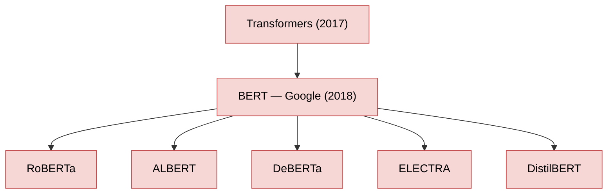
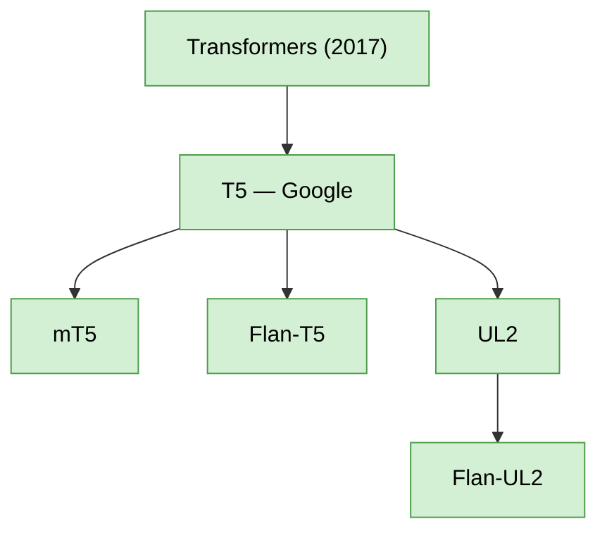
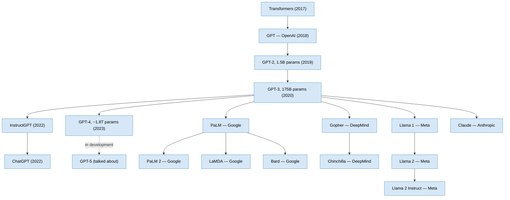
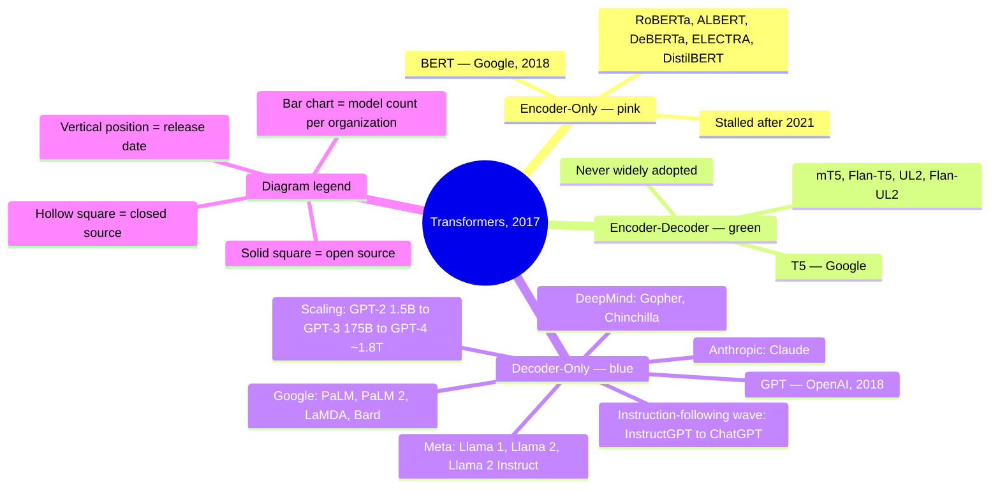

# The Current State of the Art LLMs
### Tracing how transformer architectures branched into today's landscape of language models

## Introduction

Large language models did not emerge as a single lineage. Once transformers arrived in 2017, providing the architectural groundwork for everything that followed, development split almost immediately into three distinct branches — encoder-only, encoder-decoder, and decoder-only — each pursued by different labs, at different points, toward different goals.

That branching is best captured in what's commonly called the evolutionary tree of LLMs: a timeline-based diagram tracing how models descend from transformers and from each other. Despite its density, the diagram follows a simple visual grammar. The three branches are color-coded — pink for encoder-only, green for encoder-decoder, blue for decoder-only — and within each branch, a model's vertical position marks its release date, while solid squares mark open-source models and hollow squares mark closed-source ones. A stacked bar chart in the corner of the full diagram tallies how many models each contributing company or institution has released. Understanding this tree branch by branch is the fastest way to understand where today's LLM landscape actually came from.

## Encoder-Only LLMs

BERT — Bidirectional Encoder Representations from Transformers — was the first encoder-only LLM, released by Google in 2018 with the goal of capturing context from both directions in a sentence simultaneously, rather than reading left-to-right only.

BERT's success drove a wave of follow-on models built on the same architecture — RoBERTa, ALBERT, DeBERTa, ELECTRA, and DistilBERT among them. But this line of research didn't continue past 2021: performance gains from further encoder-only development weren't promising enough to sustain interest, and the field's attention shifted toward the two remaining branches.

## Encoder-Decoder LLMs

Google took the lead on the encoder-decoder branch, starting with T5 as the initial model in this line.

Each successor — mT5, Flan-T5, UL2, Flan-UL2 — was designed around a different training objective rather than a fundamentally different architecture. Like the encoder-only branch, encoder-decoder models never achieved widespread adoption across the broader research community, leaving the third branch as the dominant path forward.

## Decoder-Only LLMs

Decoder-only models are the most compelling architecture of the three, judged by sheer volume of models released and by real-world adoption. The branch began in 2018, when OpenAI introduced the Generative Pre-trained Transformer — GPT — trained to predict the next word in a sequence and then applied across a wide range of tasks with strong results.

The scaling trend across this branch is the branch's defining feature. Having noticed that performance rose with both model size and training data, OpenAI scaled GPT into GPT-2 (1.5 billion parameters), then GPT-3 (175 billion parameters), then GPT-4 (approaching 1.8 trillion parameters) — with GPT-5 reportedly in development at the time of this recording. Other labs followed with their own decoder-only lines: Google's PaLM and PaLM 2, DeepMind's Gopher and Chinchilla, Meta's Llama 1 and Llama 2.

A second wave within this branch shifted focus from raw text completion to instruction-following. OpenAI fine-tuned GPT-3 on an instruction dataset to produce InstructGPT, the first instruction-following model, then quickly followed with ChatGPT — which triggered massive public and research interest. The same pattern — pretrain on text completion, then fine-tune on instruction data — produced LaMDA and Bard from Google, Claude from Anthropic, and Llama 2 Instruct from Meta.

## The Field After ChatGPT

ChatGPT's release marks a turning point in the pace of the field: hundreds of LLMs are now released every month by institutions worldwide. OpenAI kick-started this acceleration, with Google, Meta, and a range of other research institutions following closely behind — a concentration reflected directly in the bar chart accompanying the decoder-only tree, which ranks contributing organizations by model count.

## Key Takeaway

Every current LLM traces back to the 2017 transformer architecture, but the three branches it produced had very different trajectories: encoder-only models rose and stalled with BERT by 2021, encoder-decoder models stayed a largely Google-only experiment centered on T5, and decoder-only models became the dominant architecture — scaling from GPT's original 2018 design through trillion-parameter models, and splitting further into raw completion models versus instruction-following models after ChatGPT's release reshaped the field's priorities.

## Quick Reference

