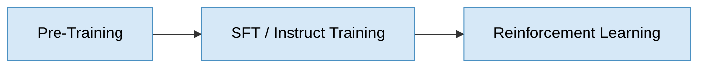
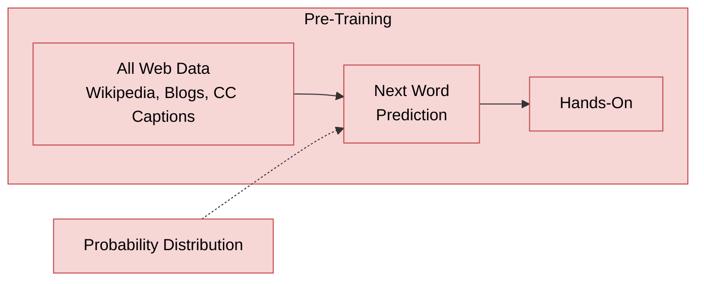
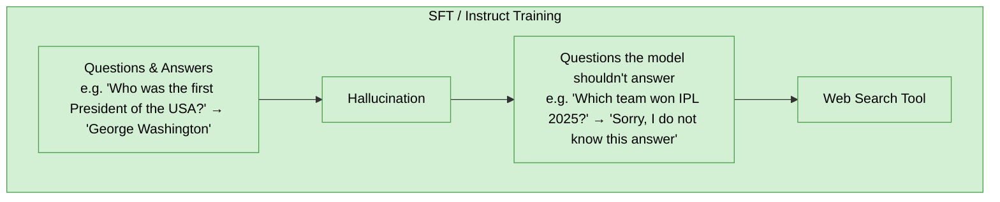
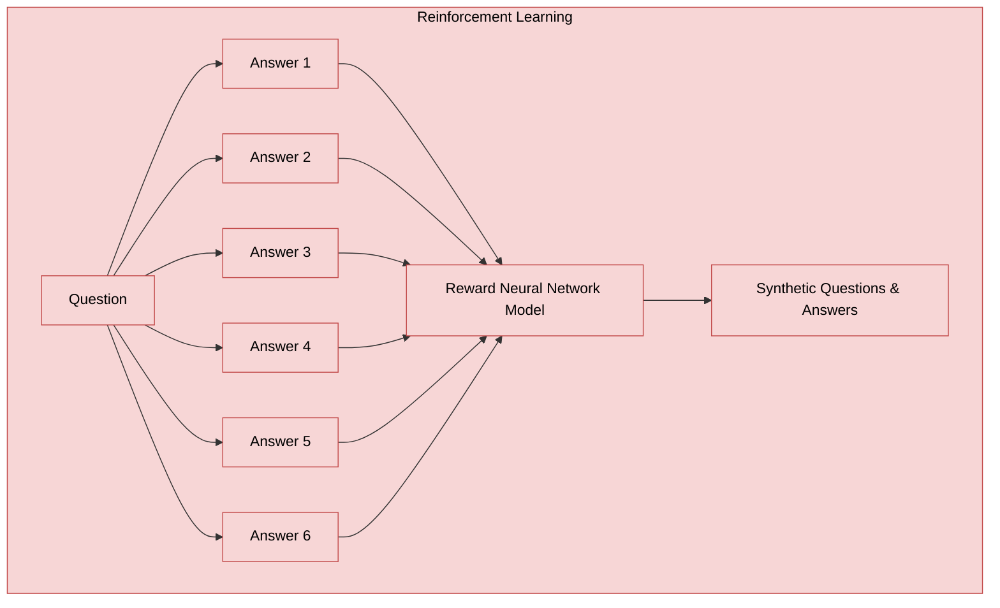
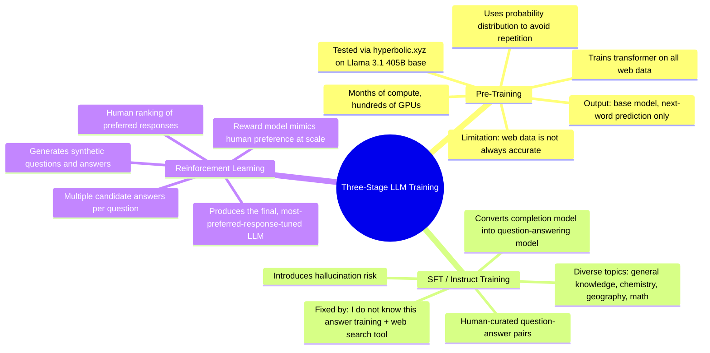

# How Large Language Models Are Actually Trained
### Three stages — pretraining, supervised fine-tuning, and reinforcement learning — that turn raw web text into a chatbot

## Introduction

Every large language model in production today, regardless of which lab built it, is produced by the same three-stage process: pretraining, supervised fine-tuning, and reinforcement learning. Each stage solves a problem the previous one leaves behind — pretraining produces a model that can only complete text, supervised fine-tuning turns that completion engine into something that answers questions, and reinforcement learning turns decent answers into consistently preferred ones. Understanding these three stages in sequence is the clearest way to understand what a model like GPT-4 or DeepSeek's models actually are under the hood, and why they behave the way they do — including why they sometimes confidently state things that are false.

## Pretraining: Learning to Predict the Next Word

Pretraining trains a transformer neural network on essentially all the text available on the web — Wikipedia, blogs, and closed captions among the sources. This is an expensive process, taking months and several hundred GPUs, and what comes out the other end is called a base model: a model whose only real skill is predicting the most likely next word given the words that came before it.

A model that always output the single most probable word would repeat itself constantly and read as mechanical. To avoid this, the base model samples from a probability distribution over likely next words rather than always picking the top choice, which is why the same prompt can produce different completions across runs.

### Testing a Base Model Directly

Hyperbolic is a platform that exposes raw base models for testing — in this case, Llama 3.1 405B in its base form. Prompting it with "The day today is" and asking for a short completion produces a description of a historical event in Indian history, complete with a specific date claim. That output reveals two things at once: the model is inferring context (like location) from something beyond the raw prompt, and — more importantly — its response isn't an "answer," it's a continuation of whatever text pattern the model has seen most often following that phrase.

Base models can still be made useful through prompt framing rather than direct instruction. Feeding the model "The 5 largest continents in the world are" and stopping there — phrasing that mimics the shape of an answer rather than issuing a command — produces the correct list: Asia, Africa, North America, South America, and Antarctica, along with the fact that Russia is the largest country. The model isn't reasoning toward this answer; it's completing a pattern that looks like text it's seen before.

A more revealing test uses a chunk of real Wikipedia text as the prompt — in this case, the opening of the "Image" article — and stops partway through. The base model's completion continues almost verbatim from the actual Wikipedia article: after "A photograph is an image created by light falling on a light-sensitive surface," it goes on to describe three-dimensional images like carvings or sculptures and mentions display through other media such as projection, matching the source article closely. This demonstrates directly that base models are reproducing patterns memorized from training data, not generating independent knowledge — and that the accuracy of what they produce is only as good as what was on the web to begin with.

The core limitation to take from this stage: base models are trained on web data, which is sometimes accurate and sometimes misleading, and the model itself has no mechanism at this stage for telling the difference.

## Supervised Fine-Tuning: Learning to Answer Questions

Base models complete text; they don't answer questions the way ChatGPT does. Getting from one to the other requires a second stage: supervised fine-tuning (SFT), also called instruct training. Here, humans prepare a diverse set of question-and-answer pairs — spanning general knowledge, chemistry, geography, math, and more — and the model is further trained on this set to learn a new task: given a question, produce an appropriate answer, using the language knowledge it already absorbed during pretraining.

This training resolves the earlier problem cleanly — the model now answers direct questions instead of needing to be tricked into it — but it introduces a new one: hallucination. Since the model has learned "always produce an answer," asking about something it has no knowledge of — such as who won IPL 2025, an event that hadn't happened yet — still produces a confident, fabricated answer rather than an admission of not knowing.

The fix is a further round of training using questions the model is known not to have an answer to, paired with the expected response "I do not know this answer." This teaches the model to recognize the boundary of its own knowledge rather than always generating something. In the most recent models, this stage gets an additional capability: the model can be prompted to search the web for questions about events after its training cutoff, retrieve relevant context, and answer using that retrieved information rather than defaulting to "I don't know" or guessing.

The result of this stage is a model that answers questions and mostly avoids hallucination — decent, but not yet great.

## Reinforcement Learning: Learning Which Answer Is Preferred

The gap between a decent model and a great one is closed by reinforcement learning: learning through repeated trials, refined by feedback on which output is preferred. The original approach for this is to take a single question, generate several candidate answers, and have humans rank them — assigning a rating that reflects which response is most preferred, even when multiple answers are technically correct.

This ranking approach works remarkably well, but it doesn't scale by brute human effort alone — even with a thousand people generating questions and rankings, the achievable volume tops out somewhere in the tens or low hundreds of thousands of examples. The solution is to simulate human judgment: after collecting an initial batch of human rankings, a separate, smaller neural network — the reward model — is trained to mimic that human preference behavior. This reward model then generates synthetic questions and synthetic answers at much greater scale, producing a training dataset that teaches the original LLM which kinds of responses are preferred, without requiring a human to rank every single example.

## Key Takeaway

Every stage in this pipeline fixes a specific failure of the one before it: pretraining produces a model that can only complete text plausibly, without any sense of what's true; supervised fine-tuning turns that into a model that answers questions directly, at the cost of confident hallucination on things it doesn't know; and reinforcement learning — bootstrapped through a reward model that mimics human preference at scale — refines "an answer" into "the answer humans actually prefer." A model's quality at any given moment reflects how much investment has gone into each of these three stages, not just its raw size.

## Quick Reference

