# Generative AI Glossary — Mindmap

Source: *The Generative AI Glossary* (Analytics Vidhya)

```mermaid
mindmap
  root((Gen AI Glossary))
    A
      Activation Function
      Agents
      AI Ethics
      API
      Attention
      Auto Merging Retriever
    B
      Backpropagation
      Backward Diffusion
      BARD
      BERT
      Bias
    C
      Chain of Density
      Chain of Dictionary
      Chain of Emotion
      Chain of Explanation
      Chain of Knowledge
      Chain of Numerical Reasoning
      Chain of Question
      Chain of Symbol
      Chain of Thought
    D
      Data Parallelism
      DDPG
      DDPM
      Decoder
      Deep Learning
      Deep Speed
      "Denoising Autoencoder (DAE)"
      Diffusion Model
    E
      Embedding Layer
      Encoder
      Epoch
    F
      Faithfulness
      Falcon AI
      Few Shot Prompting
      Fine-tuning
      Forward Diffusion
      Foundation Model
      Fully Sharded Data Parallelism
    G
      GANs
      Gaussian Noise
      Gemini
      Generative AI
      GLIDE
      GPT
      Gradient Descent
    H
      Hidden State
      Hit Rate
      Hugging Face
      Hybrid Fusion Retriever
      Hyperparameter
    I
      IPEX
      Image Recognition
      Indexing
    J
      Joint Attention
    L
      Langchain
      LangChain Legacy Syntax
      LangGraph
      LangServe
      LangSmith
      Large Language Model
      Latent Diffusion
      Latent Space
      LIMA
      LlamaIndex
      LLMops
      LoRA
      LSTMs
    M
      Markov Chain
      Midjourney
      MLops
      Model Architecture
      Model Parallelism
      MRR
      Multi-document Agents
    N
      NLP
      No-code AI
      Noise Schedule
    O
      One Shot Prompting
      Output Parsers
    P
      Parallel Paradigm
      PEFT
      Pipeline Parallelism
      Positional Encoding
      Prompt Engineering
      Pyspark
    Q
      QLoRA
      Quantization
      Query Interface
    R
      RAG
      Reconstruction Loss
      Recursive Retriever
      Reinforcement Learning
      Relevance AI
      Responsible AI
      Retrievers
      RLHF
      Runpod
    S
      Sampling
      Self-consistency Prompting
      Sentence Window Retriever
      Spark ML
      Stable Diffusion
      Streamlit
    T
      Tensor Parallelism
      Text to 3D
      Tokenization
      Transformers
      Tree of Thought
    U
      Underfitting
      UNet
      Unsupervised Learning
    V
      "Variational Autoencoder (VAE)"
      Variational Inference
      Vector Database
      Verify and Edit Prompting
    W
      Weight
      Word Embedding
    Z
      Zero-shot Prompting
```

---

## Concept-Grouped Mindmap (Related Terms Clustered)

This version groups terms by theme/relationship rather than alphabetically — useful for seeing how concepts connect.

```mermaid
mindmap
  root((Gen AI Concepts))
    Neural Network Fundamentals
      Deep Learning
      Activation Function
      Backpropagation
      Gradient Descent
      Epoch
      Hyperparameter
      Weight
      Hidden State
      Embedding Layer
      Word Embedding
      Model Architecture
      Underfitting
    Transformer and LLM Architecture
      Transformers
      Attention
      Joint Attention
      Positional Encoding
      Encoder
      Decoder
      Tokenization
      LSTMs
      Large Language Model
      BERT
      GPT
    Generative Modeling
      Generative AI
      Foundation Model
      GANs
      "Variational Autoencoder (VAE)"
      Variational Inference
    Diffusion Models
      Diffusion Model
      Forward Diffusion
      Backward Diffusion
      DDPM
      "Denoising Autoencoder (DAE)"
      Gaussian Noise
      Noise Schedule
      Latent Diffusion
      Latent Space
      Reconstruction Loss
      Sampling
      Markov Chain
      UNet
      Stable Diffusion
      GLIDE
      Midjourney
      Text to 3D
    Prompt Engineering Techniques
      Prompt Engineering
      Zero-shot Prompting
      One Shot Prompting
      Few Shot Prompting
      Chain of Thought
      Chain of Density
      Chain of Dictionary
      Chain of Emotion
      Chain of Explanation
      Chain of Knowledge
      Chain of Numerical Reasoning
      Chain of Question
      Chain of Symbol
      Self-consistency Prompting
      Tree of Thought
      Verify and Edit Prompting
    Fine-tuning and Model Optimization
      Fine-tuning
      LoRA
      QLoRA
      PEFT
      Quantization
      LIMA
    Training Infrastructure and Parallelism
      Data Parallelism
      Model Parallelism
      Pipeline Parallelism
      Tensor Parallelism
      Parallel Paradigm
      Fully Sharded Data Parallelism
      Deep Speed
      IPEX
      Runpod
      Pyspark
      Spark ML
      MLops
      LLMops
    Retrieval and RAG
      RAG
      Retrievers
      Recursive Retriever
      Sentence Window Retriever
      Hybrid Fusion Retriever
      Auto Merging Retriever
      Vector Database
      Indexing
      Query Interface
      Hit Rate
      MRR
      Faithfulness
    Agents and Applications
      Agents
      Multi-document Agents
      No-code AI
      Output Parsers
      Image Recognition
    Frameworks and Platforms
      Langchain
      LangChain Legacy Syntax
      LangGraph
      LangServe
      LangSmith
      LlamaIndex
      Hugging Face
      Streamlit
      Relevance AI
      Falcon AI
    Notable Models and Products
      BARD
      Gemini
    Learning Paradigms
      Reinforcement Learning
      DDPG
      RLHF
      Unsupervised Learning
    Ethics and Responsibility
      AI Ethics
      Bias
      Responsible AI
    Core Fields
      NLP
      API
```

---

## Graph Diagram (Nodes & Edges, Colored)

Same concept groupings as above, but rendered as an actual graph — a central root node, colored category hubs, and colored edges connecting each hub to its terms. Each cluster has its own color for both nodes and edges so you can visually trace which terms belong together.

```mermaid
flowchart TD
    Root((Gen AI Concepts))

    subgraph NN [Neural Network Fundamentals]
        HNN[Neural Network Fundamentals]
        NN1[Deep Learning]
        NN2[Activation Function]
        NN3[Backpropagation]
        NN4[Gradient Descent]
        NN5[Epoch]
        NN6[Hyperparameter]
        NN7[Weight]
        NN8[Hidden State]
        NN9[Embedding Layer]
        NN10[Word Embedding]
        NN11[Model Architecture]
        NN12[Underfitting]
    end

    subgraph TR [Transformer and LLM Architecture]
        HTR[Transformer and LLM Architecture]
        TR1[Transformers]
        TR2[Attention]
        TR3[Joint Attention]
        TR4[Positional Encoding]
        TR5[Encoder]
        TR6[Decoder]
        TR7[Tokenization]
        TR8[LSTMs]
        TR9[Large Language Model]
        TR10[BERT]
        TR11[GPT]
    end

    subgraph GM [Generative Modeling]
        HGM[Generative Modeling]
        GM1[Generative AI]
        GM2[Foundation Model]
        GM3[GANs]
        GM4["Variational Autoencoder (VAE)"]
        GM5[Variational Inference]
    end

    subgraph DF [Diffusion Models]
        HDF[Diffusion Models]
        DF1[Diffusion Model]
        DF2[Forward Diffusion]
        DF3[Backward Diffusion]
        DF4[DDPM]
        DF5["Denoising Autoencoder (DAE)"]
        DF6[Gaussian Noise]
        DF7[Noise Schedule]
        DF8[Latent Diffusion]
        DF9[Latent Space]
        DF10[Reconstruction Loss]
        DF11[Sampling]
        DF12[Markov Chain]
        DF13[UNet]
        DF14[Stable Diffusion]
        DF15[GLIDE]
        DF16[Midjourney]
        DF17[Text to 3D]
    end

    subgraph PE [Prompt Engineering Techniques]
        HPE[Prompt Engineering Techniques]
        PE1[Prompt Engineering]
        PE2[Zero-shot Prompting]
        PE3[One Shot Prompting]
        PE4[Few Shot Prompting]
        PE5[Chain of Thought]
        PE6[Chain of Density]
        PE7[Chain of Dictionary]
        PE8[Chain of Emotion]
        PE9[Chain of Explanation]
        PE10[Chain of Knowledge]
        PE11[Chain of Numerical Reasoning]
        PE12[Chain of Question]
        PE13[Chain of Symbol]
        PE14[Self-consistency Prompting]
        PE15[Tree of Thought]
        PE16[Verify and Edit Prompting]
    end

    subgraph FT [Fine-tuning and Model Optimization]
        HFT[Fine-tuning and Model Optimization]
        FT1[Fine-tuning]
        FT2[LoRA]
        FT3[QLoRA]
        FT4[PEFT]
        FT5[Quantization]
        FT6[LIMA]
    end

    subgraph IN [Training Infrastructure and Parallelism]
        HIN[Training Infrastructure and Parallelism]
        IN1[Data Parallelism]
        IN2[Model Parallelism]
        IN3[Pipeline Parallelism]
        IN4[Tensor Parallelism]
        IN5[Parallel Paradigm]
        IN6[Fully Sharded Data Parallelism]
        IN7[Deep Speed]
        IN8[IPEX]
        IN9[Runpod]
        IN10[Pyspark]
        IN11[Spark ML]
        IN12[MLops]
        IN13[LLMops]
    end

    subgraph RA [Retrieval and RAG]
        HRA[Retrieval and RAG]
        RA1[RAG]
        RA2[Retrievers]
        RA3[Recursive Retriever]
        RA4[Sentence Window Retriever]
        RA5[Hybrid Fusion Retriever]
        RA6[Auto Merging Retriever]
        RA7[Vector Database]
        RA8[Indexing]
        RA9[Query Interface]
        RA10[Hit Rate]
        RA11[MRR]
        RA12[Faithfulness]
    end

    subgraph AG [Agents and Applications]
        HAG[Agents and Applications]
        AG1[Agents]
        AG2[Multi-document Agents]
        AG3[No-code AI]
        AG4[Output Parsers]
        AG5[Image Recognition]
    end

    subgraph FR [Frameworks and Platforms]
        HFR[Frameworks and Platforms]
        FR1[Langchain]
        FR2[LangChain Legacy Syntax]
        FR3[LangGraph]
        FR4[LangServe]
        FR5[LangSmith]
        FR6[LlamaIndex]
        FR7[Hugging Face]
        FR8[Streamlit]
        FR9[Relevance AI]
        FR10[Falcon AI]
    end

    subgraph NM [Notable Models and Products]
        HNM[Notable Models and Products]
        NM1[BARD]
        NM2[Gemini]
    end

    subgraph LP [Learning Paradigms]
        HLP[Learning Paradigms]
        LP1[Reinforcement Learning]
        LP2[DDPG]
        LP3[RLHF]
        LP4[Unsupervised Learning]
    end

    subgraph ET [Ethics and Responsibility]
        HET[Ethics and Responsibility]
        ET1[AI Ethics]
        ET2[Bias]
        ET3[Responsible AI]
    end

    subgraph CF [Core Fields]
        HCF[Core Fields]
        CF1[NLP]
        CF2[API]
    end

    Root --> HNN
    Root --> HTR
    Root --> HGM
    Root --> HDF
    Root --> HPE
    Root --> HFT
    Root --> HIN
    Root --> HRA
    Root --> HAG
    Root --> HFR
    Root --> HNM
    Root --> HLP
    Root --> HET
    Root --> HCF

    HNN --> NN1
    HNN --> NN2
    HNN --> NN3
    HNN --> NN4
    HNN --> NN5
    HNN --> NN6
    HNN --> NN7
    HNN --> NN8
    HNN --> NN9
    HNN --> NN10
    HNN --> NN11
    HNN --> NN12

    HTR --> TR1
    HTR --> TR2
    HTR --> TR3
    HTR --> TR4
    HTR --> TR5
    HTR --> TR6
    HTR --> TR7
    HTR --> TR8
    HTR --> TR9
    HTR --> TR10
    HTR --> TR11

    HGM --> GM1
    HGM --> GM2
    HGM --> GM3
    HGM --> GM4
    HGM --> GM5

    HDF --> DF1
    HDF --> DF2
    HDF --> DF3
    HDF --> DF4
    HDF --> DF5
    HDF --> DF6
    HDF --> DF7
    HDF --> DF8
    HDF --> DF9
    HDF --> DF10
    HDF --> DF11
    HDF --> DF12
    HDF --> DF13
    HDF --> DF14
    HDF --> DF15
    HDF --> DF16
    HDF --> DF17

    HPE --> PE1
    HPE --> PE2
    HPE --> PE3
    HPE --> PE4
    HPE --> PE5
    HPE --> PE6
    HPE --> PE7
    HPE --> PE8
    HPE --> PE9
    HPE --> PE10
    HPE --> PE11
    HPE --> PE12
    HPE --> PE13
    HPE --> PE14
    HPE --> PE15
    HPE --> PE16

    HFT --> FT1
    HFT --> FT2
    HFT --> FT3
    HFT --> FT4
    HFT --> FT5
    HFT --> FT6

    HIN --> IN1
    HIN --> IN2
    HIN --> IN3
    HIN --> IN4
    HIN --> IN5
    HIN --> IN6
    HIN --> IN7
    HIN --> IN8
    HIN --> IN9
    HIN --> IN10
    HIN --> IN11
    HIN --> IN12
    HIN --> IN13

    HRA --> RA1
    HRA --> RA2
    HRA --> RA3
    HRA --> RA4
    HRA --> RA5
    HRA --> RA6
    HRA --> RA7
    HRA --> RA8
    HRA --> RA9
    HRA --> RA10
    HRA --> RA11
    HRA --> RA12

    HAG --> AG1
    HAG --> AG2
    HAG --> AG3
    HAG --> AG4
    HAG --> AG5

    HFR --> FR1
    HFR --> FR2
    HFR --> FR3
    HFR --> FR4
    HFR --> FR5
    HFR --> FR6
    HFR --> FR7
    HFR --> FR8
    HFR --> FR9
    HFR --> FR10

    HNM --> NM1
    HNM --> NM2

    HLP --> LP1
    HLP --> LP2
    HLP --> LP3
    HLP --> LP4

    HET --> ET1
    HET --> ET2
    HET --> ET3

    HCF --> CF1
    HCF --> CF2

    classDef nnClass fill:#d6e8f7,stroke:#4a90c2,color:#000000;
    classDef trClass fill:#d4f0d4,stroke:#4ac26b,color:#000000;
    classDef gmClass fill:#e0d4f7,stroke:#9b59b6,color:#000000;
    classDef dfClass fill:#f7d6ec,stroke:#c2529c,color:#000000;
    classDef peClass fill:#f7f5d6,stroke:#b5b02e,color:#000000;
    classDef ftClass fill:#d6f7f0,stroke:#2ec2a8,color:#000000;
    classDef inClass fill:#d6dcf7,stroke:#6b74c2,color:#000000;
    classDef raClass fill:#f7d6d6,stroke:#c24a4a,color:#000000;
    classDef agClass fill:#d6f7e0,stroke:#2ec27a,color:#000000;
    classDef frClass fill:#e8d6f7,stroke:#9b6bc2,color:#000000;
    classDef nmClass fill:#d6f0f7,stroke:#4aa8c2,color:#000000;
    classDef lpClass fill:#dcf7d6,stroke:#6bc24a,color:#000000;
    classDef etClass fill:#f7d6e8,stroke:#c24a8e,color:#000000;
    classDef cfClass fill:#d6e0f7,stroke:#4a5ec2,color:#000000;
    classDef rootClass fill:#ffffff,stroke:#333333,color:#000000;

    class Root rootClass
    class HNN,NN1,NN2,NN3,NN4,NN5,NN6,NN7,NN8,NN9,NN10,NN11,NN12 nnClass
    class HTR,TR1,TR2,TR3,TR4,TR5,TR6,TR7,TR8,TR9,TR10,TR11 trClass
    class HGM,GM1,GM2,GM3,GM4,GM5 gmClass
    class HDF,DF1,DF2,DF3,DF4,DF5,DF6,DF7,DF8,DF9,DF10,DF11,DF12,DF13,DF14,DF15,DF16,DF17 dfClass
    class HPE,PE1,PE2,PE3,PE4,PE5,PE6,PE7,PE8,PE9,PE10,PE11,PE12,PE13,PE14,PE15,PE16 peClass
    class HFT,FT1,FT2,FT3,FT4,FT5,FT6 ftClass
    class HIN,IN1,IN2,IN3,IN4,IN5,IN6,IN7,IN8,IN9,IN10,IN11,IN12,IN13 inClass
    class HRA,RA1,RA2,RA3,RA4,RA5,RA6,RA7,RA8,RA9,RA10,RA11,RA12 raClass
    class HAG,AG1,AG2,AG3,AG4,AG5 agClass
    class HFR,FR1,FR2,FR3,FR4,FR5,FR6,FR7,FR8,FR9,FR10 frClass
    class HNM,NM1,NM2 nmClass
    class HLP,LP1,LP2,LP3,LP4 lpClass
    class HET,ET1,ET2,ET3 etClass
    class HCF,CF1,CF2 cfClass

    style NN fill:#d6e8f7,stroke:#4a90c2,color:#000000
    style TR fill:#d4f0d4,stroke:#4ac26b,color:#000000
    style GM fill:#e0d4f7,stroke:#9b59b6,color:#000000
    style DF fill:#f7d6ec,stroke:#c2529c,color:#000000
    style PE fill:#f7f5d6,stroke:#b5b02e,color:#000000
    style FT fill:#d6f7f0,stroke:#2ec2a8,color:#000000
    style IN fill:#d6dcf7,stroke:#6b74c2,color:#000000
    style RA fill:#f7d6d6,stroke:#c24a4a,color:#000000
    style AG fill:#d6f7e0,stroke:#2ec27a,color:#000000
    style FR fill:#e8d6f7,stroke:#9b6bc2,color:#000000
    style NM fill:#d6f0f7,stroke:#4aa8c2,color:#000000
    style LP fill:#dcf7d6,stroke:#6bc24a,color:#000000
    style ET fill:#f7d6e8,stroke:#c24a8e,color:#000000
    style CF fill:#d6e0f7,stroke:#4a5ec2,color:#000000

    linkStyle 0 stroke:#4a90c2,stroke-width:2px
    linkStyle 1 stroke:#4ac26b,stroke-width:2px
    linkStyle 2 stroke:#9b59b6,stroke-width:2px
    linkStyle 3 stroke:#c2529c,stroke-width:2px
    linkStyle 4 stroke:#b5b02e,stroke-width:2px
    linkStyle 5 stroke:#2ec2a8,stroke-width:2px
    linkStyle 6 stroke:#6b74c2,stroke-width:2px
    linkStyle 7 stroke:#c24a4a,stroke-width:2px
    linkStyle 8 stroke:#2ec27a,stroke-width:2px
    linkStyle 9 stroke:#9b6bc2,stroke-width:2px
    linkStyle 10 stroke:#4aa8c2,stroke-width:2px
    linkStyle 11 stroke:#6bc24a,stroke-width:2px
    linkStyle 12 stroke:#c24a8e,stroke-width:2px
    linkStyle 13 stroke:#4a5ec2,stroke-width:2px
    linkStyle 14,15,16,17,18,19,20,21,22,23,24,25 stroke:#4a90c2,stroke-width:1.5px
    linkStyle 26,27,28,29,30,31,32,33,34,35,36 stroke:#4ac26b,stroke-width:1.5px
    linkStyle 37,38,39,40,41 stroke:#9b59b6,stroke-width:1.5px
    linkStyle 42,43,44,45,46,47,48,49,50,51,52,53,54,55,56,57,58 stroke:#c2529c,stroke-width:1.5px
    linkStyle 59,60,61,62,63,64,65,66,67,68,69,70,71,72,73,74 stroke:#b5b02e,stroke-width:1.5px
    linkStyle 75,76,77,78,79,80 stroke:#2ec2a8,stroke-width:1.5px
    linkStyle 81,82,83,84,85,86,87,88,89,90,91,92,93 stroke:#6b74c2,stroke-width:1.5px
    linkStyle 94,95,96,97,98,99,100,101,102,103,104,105 stroke:#c24a4a,stroke-width:1.5px
    linkStyle 106,107,108,109,110 stroke:#2ec27a,stroke-width:1.5px
    linkStyle 111,112,113,114,115,116,117,118,119,120 stroke:#9b6bc2,stroke-width:1.5px
    linkStyle 121,122 stroke:#4aa8c2,stroke-width:1.5px
    linkStyle 123,124,125,126 stroke:#6bc24a,stroke-width:1.5px
    linkStyle 127,128,129 stroke:#c24a8e,stroke-width:1.5px
    linkStyle 130,131 stroke:#4a5ec2,stroke-width:1.5px
```



*Note: this is a large, dense graph (14 clusters, ~118 term nodes). If your Mermaid renderer struggles with the full graph, try the [Mermaid Live Editor](https://mermaid.live) which handles large diagrams well, or ask me to split it into one diagram per cluster.*


